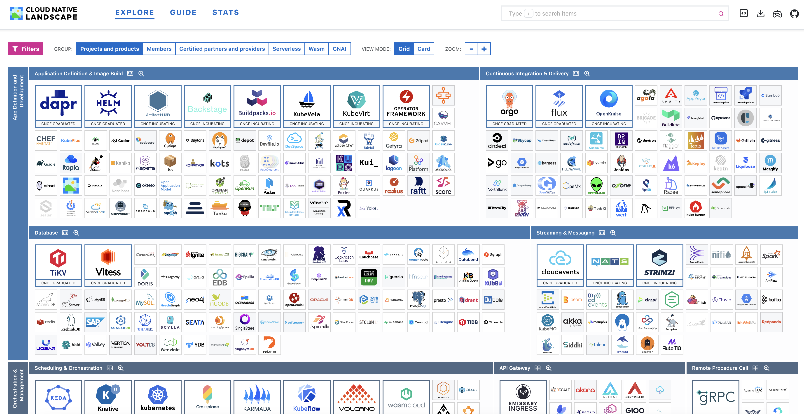

# 1章 クラウドネイティブとKubernetes

- [1章 クラウドネイティブとKubernetes](#1章-クラウドネイティブとkubernetes)
  - [1. クラウドネイティブとは](#1-クラウドネイティブとは)
  - [2. Kubernetes とは](#2-kubernetes-とは)
  - [3. Kubernetes の特徴](#3-kubernetes-の特徴)
    - [3.1 インフラリソースの抽象化](#31-インフラリソースの抽象化)
    - [3.2 インフラのコード化 (Infrastructure as Code)](#32-インフラのコード化-infrastructure-as-code)
    - [3.3 オーケストレーション](#33-オーケストレーション)
    - [3.4 柔軟性と拡張性](#34-柔軟性と拡張性)
    - [3.5 オープンソース](#35-オープンソース)
    - [3.6 豊富なエコシステム](#36-豊富なエコシステム)
  - [4. Kubernetesを構成するコンポーネント](#4-kubernetesを構成するコンポーネント)
    - [4.1 コントロールプレーン](#41-コントロールプレーン)
    - [4.2 ワーカーノード](#42-ワーカーノード)
  - [5. Kubernetes の主要なリソース](#5-kubernetes-の主要なリソース)
    - [5.1 Pod](#51-pod)
    - [5.2 ReplicaSet](#52-replicaset)
    - [5.3 Deployment](#53-deployment)
    - [5.4 DaemonSet](#54-daemonset)
    - [5.5 Job](#55-job)
    - [5.6 Service](#56-service)
    - [5.7 Ingress](#57-ingress)
    - [5.8 ConfigMap](#58-configmap)
    - [5.9 Secret](#59-secret)
    - [5.10 Namespace](#510-namespace)
    - [5.11 Role/ClusterRole](#511-roleclusterrole)
  - [6. クライアントツール](#6-クライアントツール)
    - [6.1 kubectl](#61-kubectl)
    - [6.2 Helm](#62-helm)
    - [6.3 krew](#63-krew)
    - [6.4 k9s](#64-k9s)
  - [7. 学習コンテンツ](#7-学習コンテンツ)
    - [7.1 Kubernetes The Hard Way](#71-kubernetes-the-hard-way)
    - [7.2 一日で学ぶクラウドネイティブ技術実践ハンズオン](#72-一日で学ぶクラウドネイティブ技術実践ハンズオン)
  - [8. まとめ](#8-まとめ)
  - [次のステップ](#次のステップ)

## 1. クラウドネイティブとは

> クラウドネイティブ技術は、パブリッククラウド、プライベートクラウド、ハイブリッドクラウドなどの近代的でダイナミックな環境において、スケーラブルなアプリケーションを構築および実行するための能力を組織にもたらします。 このアプローチの代表例に、コンテナ、サービスメッシュ、マイクロサービス、イミュータブルインフラストラクチャ、および宣言型APIがあります。
>
> これらの手法により、回復性、管理力、および可観測性のある疎結合システムが実現します。 これらを堅牢な自動化と組み合わせることで、エンジニアはインパクトのある変更を最小限の労力で頻繁かつ予測どおりに行うことができます。

引用元: https://github.com/cncf/toc/blob/main/DEFINITION.md

クラウドネイティブとは、クラウドの特性を最大限に活用するために、最初からクラウド環境での利用を前提に設計・開発されたシステムやアプリケーション、そしてそれを実現するためのソフトウェアアプローチを指します。<br/>
単にオンプレミスのシステムをクラウドに移行するのではなく、コンテナ、マイクロサービス、サービスメッシュなどのクラウドネイティブ技術を用いることで、スケーラビリティ（拡張性）や柔軟性、回復力に優れたシステムを構築し、開発の迅速化やコスト最適化などのメリットを得ることができます。

クラウドネイティブの主要技術と役割:

| 技術要素 | 役割/機能 | クラウドネイティブでの位置付け |
|---|---|---|
| マイクロサービス | アプリケーションの機能を疎結合な独立サービスに分割 | 俊敏性、独立したデプロイメントの実現 |
| コンテナ | アプリケーションコードと依存関係のポータブルなパッケージング | 環境再現性と移植性の実現、最小実行単位 |
| Kubernetes | コンテナ化されたワークロードのデプロイ、スケーリング、管理の自動化 | プラットフォームの制御層（オーケストレーションエンジン） |
| イミュータブルインフラストラクチャ | インフラの変更を「更新」ではなく「置き換え」で行う設計 | 堅牢性、予測可能性、自動化の促進  |
| サービスメッシュ | マイクロサービス間の通信、セキュリティ、可観測性の管理 | 複雑なサービス間通信を管理・制御する専用のインフラ層 |

## 2. Kubernetes とは

Kubernetes は、クラウドネイティブの中核となる、コンテナシステムを支える代表的なプラットフォームです。

> Kubernetesは、宣言的な構成管理と自動化を促進し、コンテナ化されたワークロードやサービスを管理するための、ポータブルで拡張性のあるオープンソースのプラットフォームです。Kubernetesは巨大で急速に成長しているエコシステムを備えており、それらのサービス、サポート、ツールは幅広い形で利用可能です。

引用元: https://kubernetes.io/docs/concepts/overview/

Kubernetes は [Cloud Native Computing Foundation](https://www.cncf.io/) (CNCF) がホストするプロジェクトです。

CNCF はクラウドネイティブな OSS 技術の推進を行う団体で、2015年に Linux Foundation 傘下に設立されました。<br/>
Kubernetes がその1つ目のプロジェクトとして、Google から CNCF に寄贈され、2018年に最初の Graduated (卒業) プロジェクトとなりました。

Kubernetes はコンテナの実行基盤として広く利用されています。AWS や Google Cloud をはじめ、主要なクラウドプロバイダーはマネージドサービスとして Kubernetes を提供しています。<br/>
さらに、オンプレミス環境やローカル開発環境など、パブリッククラウド以外の様々な環境にも導入することができます。

Kubernetes の機能:

- サービスディスカバリーと負荷分散
  - Kubernetes は、DNS 名または独自のIPアドレスを使ってコンテナを公開することができます。コンテナへのトラフィックが多い場合は、Kubernetes は負荷分散し、ネットワークトラフィックを振り分けることができるため、デプロイが安定します。
- ストレージオーケストレーション
  - Kubernetes は、ローカルストレージやパブリッククラウドプロバイダなど、選択したストレージシステムを自動でマウントすることができます。
- 自動化されたロールアウトとロールバック
  - Kubernetes を使うとデプロイしたコンテナのあるべき状態を記述することができ、制御されたスピードで実際の状態をあるべき状態に変更することができます。例えば、アプリケーションのデプロイのために、新しいコンテナの作成や既存コンテナの削除、新しいコンテナにあらゆるリソースを適用する作業を、Kubernetes で自動化できます。
- 自動ビンパッキング
  - コンテナ化されたタスクを実行するノードのクラスタを Kubernetes へ提供します。各コンテナがどれくらい CPU やメモリー (RAM) を必要とするのかを Kubernetes に宣言することができます。Kubernetes はコンテナをノードにあわせて調整することができ、リソースを最大限に活用してくれます。
- 自己修復
  - Kubernetes は、処理が失敗したコンテナを再起動し、コンテナを入れ替え、定義したヘルスチェックに応答しないコンテナを強制終了します。処理の準備ができるまでは、クライアントに通知しません。
- 機密情報と構成管理
  - Kubernetes は、パスワードや OAuth トークン、SSH キーなどの機密の情報を保持し、管理することができます。機密情報をデプロイし、コンテナイメージを再作成することなくアプリケーションの構成情報を更新することができます。スタック構成の中で機密情報を晒してしまうこともありません。

Kubernetes の歴史:

- https://blog.risingstack.com/the-history-of-kubernetes/
- https://kubernetes.io/blog/2024/06/06/10-years-of-kubernetes/

## 3. Kubernetes の特徴

### 3.1 インフラリソースの抽象化

ネットワークやストレージなど、すべてのインフラリソースを Kubernetes 上のリソースとして管理します。Kubernetes は複数のVMを束ねて一つのクラスタを構成しますが、それぞれのVMの状態（CPUやメモリ使用率など）を気にする必要はなく、ワークロードに適切なインフラリソースを割り当てることができます。

### 3.2 インフラのコード化 (Infrastructure as Code)

Kubernetes はインフラを宣言的なコード（マニフェストファイル）として管理します。IaC により、インフラの構築や変更をコードとしてバージョン管理し、自動化することができます。マニフェストファイルにはリソースのあるべき姿（Desired State）を記述します。

### 3.3 オーケストレーション

Kubernetes を構成する各種コンポーネントが協調し、一つのクラスタを稼働させます。コンポーネント同士が直接通信・連携するのではなく、各々の役割を果たすことで全体として理想の状態を維持します。

> Kubernetes は、アプリやインフラをいい感じに管理してくれる。

- **セルフヒーリング**
  - ノードやコンテナの障害を検出し、自動的に再スケジュールや再起動を行います。
  - **例**: コンテナがクラッシュした場合、自動的に再起動されます。
- **自動スケーリング**
  - リソース使用量に基づいて、Podの数を自動的に増減します。
  - **Horizontal Pod Autoscaler**: CPU使用率やカスタムメトリクスに基づいてPodの数を調整します。

### 3.4 柔軟性と拡張性

ネットワーク、ストレージ、コンテナランタイムなど、多くの機能をプラグインを通じて拡張できます。

- [**CNI (Container Network Interface)**](https://kubernetes.io/docs/concepts/extend-kubernetes/compute-storage-net/network-plugins/): ネットワーク機能の拡張
- [**CSI (Container Storage Interface)**](https://kubernetes.io/blog/2019/01/15/container-storage-interface-ga/): ストレージ機能の拡張
- [**CRI (Container Runtime Interface)**](https://kubernetes.io/docs/concepts/architecture/cri/): コンテナランタイムの拡張
- [**Admission Controllers**](https://kubernetes.io/docs/reference/access-authn-authz/admission-controllers/): API サーバーの拡張
- [**Custom Resources**](https://kubernetes.io/docs/concepts/extend-kubernetes/api-extension/custom-resources/): Kubernetesリソースの拡張

### 3.5 オープンソース

Kubernetes はオープンソースプロジェクトであり、多くの開発者や企業がコミュニティに貢献しています。ユーザー自身も自由にソースコードを検査し、カスタマイズすることができます。

https://github.com/kubernetes/kubernetes

### 3.6 豊富なエコシステム

多くのサードパーティツールや OSS が Kubernetes と統合されており、モニタリング、ロギング、CI/CD、セキュリティなどの多くの分野で利用可能です。エコシステムの豊富さは、Kubernetes を用いた開発や運用を強力にサポートします。

https://landscape.cncf.io/



## 4. Kubernetesを構成するコンポーネント

Kubernetes は複数のコンポーネントで構成されています。<br/>
各コンポーネントは直接的な連携はせず、それぞれが理想の状態（desired state）となるように自らの役割を果たすことで、全体として一つのシステムを作り上げています。

このような仕組みを「オーケストレーション（協調）」と表現することがあります。

https://kubernetes.io/ja/docs/concepts/overview/components/


Kubernetes は大きく分けて、コントロールプレーンとワーカーノードの2つで構成されています。

### 4.1 コントロールプレーン

コントロールプレーン（Control Plane）は、Kubernetes クラスタの管理に必要なコンポーネント群で構成されています。<br/>
クラスタ全体に影響を及ぼす重要なコンポーネントであり、通常アプリケーションとは異なるノード（VM）に配置されます。

- **kube-apiserver**
  - Kubernetes APIを提供し、すべてのコンポーネントと通信します。
  - Kubernetes のフロントエンドとして機能し、すべての REST 操作を処理します。
- **etcd**
  - クラスタのすべてのデータを保存するキー・バリュー・ストア。
- **kube-scheduler**
  - 新しい Pod のスケジューリングを行い、最適なノードに割り当てます。
  - リソース要件、Pod の親和性と反親和性、ノードの可用性などを考慮します。
- **kube-controller-manager**
  - クラスタ全体の状態を管理するコントローラー群。
  - 各種コントローラ（Pod, Deployment, Node Controller など）を統合して実行します。

### 4.2 ワーカーノード

ワーカーノード（Worker Node）には、Kubernetes クラスタにデプロイしたアプリケーションが配置されます。<br/>
アプリケーションの要求スペックを満たすために必要な台数のノード（VM）が稼働し、アプリケーションのスケールに合わせてノード数を増減させます。

- **kubelet**
  - 各ノード上で実行され、Podのライフサイクルを管理します。
  - API サーバーから Pod 定義を受け取り、コンテナランタイムに指示を送ります。
- **kube-proxy**
  - 各ノード上で実行され、ネットワーク通信を管理します。
  - クラスタ内のサービス間通信を実現し、ネットワークルールを適用します。
- **コンテナランタイム**
  - 実際にコンテナを実行するソフトウェア（例：containerd、CRI-O）。
  - コンテナの実行、停止、ネットワーク設定などを行います。
  - Docker は Kubernetes v1.24 で CRI サポートが削除されたため、現在は containerd が主流です。

## 5. Kubernetes の主要なリソース

### 5.1 Pod

https://kubernetes.io/ja/docs/concepts/workloads/pods/

Pod は Kubernetes の最小のデプロイ単位で、1つ以上のコンテナを含みます。Pod 内のすべてのコンテナはストレージやネットワークなどのリソースを共有します。

通常は Pod を直接作成することはなく、Deployment や Job などのワークロードリソースを使用して Pod を作成します。

### 5.2 ReplicaSet

https://kubernetes.io/ja/docs/concepts/workloads/controllers/replicaset/

ReplicaSet は、指定された数の Pod を常に稼働させるためのリソースです。ReplicaSet を使用することで、障害が発生した際に自動的に新しい Pod を作成し、指定された Pod 数を維持します。通常は、Deployment を使用して ReplicaSet を作成します。

### 5.3 Deployment

https://kubernetes.io/ja/docs/concepts/workloads/controllers/deployment/

Deployment は、アプリケーションのデプロイと管理を簡素化するためのリソースです。Deploymentを使用すると、アプリケーションのロールアウト、ロールバック、スケーリングなどを簡単に行うことができます。Deployment は内部的に ReplicaSet を管理し、宣言された状態を維持します。

Deployment リソースの作成からコンテナ実行までの流れは下図の通りです。各 Kubernetes リソースのコントローラがそれぞれリソースを作成・変更していき、最終的に kubelet がワーカーノードにコンテナを作成します。


引用元: [A visual map of a Kubernetes deployment](https://opensource.com/article/22/3/visual-map-kubernetes-deployment)

### 5.4 DaemonSet

https://kubernetes.io/ja/docs/concepts/workloads/controllers/daemonset/

DaemonSet は、クラスタ内のすべてのノード、もしくは特定のノードにPodをデプロイするためのリソースです。例えば、ノードのログ収集やモニタリングエージェントをデプロイする際に使用されます。ノードが追加または削除されると、それに応じて Pod が自動的に追加または削除されます。

### 5.5 Job

https://kubernetes.io/ja/docs/concepts/workloads/controllers/job/

Job は、指定された数のPodを作成し、その Pod が正常に完了するまで管理するためのリソースです。バッチ処理や一回限りのタスクを実行する際に使用されます。Job は失敗したタスクを再試行し、すべてのタスクが完了するまで監視します。

### 5.6 Service

https://kubernetes.io/ja/docs/concepts/services-networking/service/

Service は Pod の集合にアクセスするためのポリシーを定義します。Service への通信は、kube-proxy によってバックエンドの Pod に転送されます。kube-proxy の実装には iptables、IPVS、eBPF、nftables などがあり、Kubernetes バージョンや環境によって異なります。

Service には3つの主要なタイプがあります。

- **ClusterIP**: クラスタ内部のIPでServiceを公開します。Pod にはクラスタ内部からのみ疎通可能となります。
- **NodePort**: 各NodeのIPにて、静的なポート(NodePort)上でServiceを公開します。
- **LoadBalancer**: クラウドプロバイダのロードバランサを使用して、Serviceを外部に公開します。

### 5.7 Ingress

https://kubernetes.io/ja/docs/concepts/services-networking/ingress/

Ingress は、HTTPやHTTPSのルーティングを提供するリソースです。外部からクラスタ内のサービスにアクセスするためのルールを定義します。これにより、単一のエントリポイントで複数のサービスにトラフィックを分散させることができます。

Ingress を使用するためには Ingress コントローラが必要です。EKS や GKE などのマネージド Kubernetes では、クラウドプロバイダー固有の Ingress コントローラが提供されていますが、それ以外の場合は別途インストールが必要です。オンプレミス環境では、Ingress NGINX Controller などの Ingress コントローラをデプロイする必要があります。

### 5.8 ConfigMap

https://kubernetes.io/ja/docs/concepts/configuration/configmap/

ConfigMap は、設定データを管理するためのリソースです。Pod 内のコンテナに環境変数、コマンドライン引数、設定ファイルとして渡すことができます。これにより、コンテナイメージを再ビルドせずにアプリケーションの設定を変更することができます。

### 5.9 Secret

https://kubernetes.io/ja/docs/concepts/configuration/secret/

Secret は、パスワード、トークン、SSHキーなどの機密情報を安全に管理するためのリソースです。ConfigMap と同様に、Pod内のコンテナに環境変数やマウントされたボリュームとして渡すことができます。Secret は、Base64エンコードされたデータとして保存され、ConfigMap よりもアクセス制御が強化されています。

**【注意!!】** Secret は Base64 デコードで容易に中身を読み取れてしまいます。Secret リソースに対してアクセス制限を設定する他、コードリポジトリに平文のまま保存することは絶対に避けてください。

### 5.10 Namespace

https://kubernetes.io/ja/docs/concepts/overview/working-with-objects/namespaces/

Namespace はクラスタ内のリソースを分離し、管理を簡素化するための仮想クラスタです。複数の環境（開発、テスト、本番など）を一つのクラスタで管理する場合や、複数のチーム・プロジェクトにまたがる多くのユーザーが存在する場合に使用します。

Namespace は RBAC によるリソースへのアクセス制限、リソースクォータによるリソース使用量の制限、NetworkPolicy による通信制限を可能にします（NetworkPolicy は CNI プラグインのサポートが必要）。

### 5.11 Role/ClusterRole

https://kubernetes.io/ja/docs/reference/access-authn-authz/rbac/

Kubernetes には RBAC (Role Based Access Control) という認可の仕組みがあります。Role/ClusterRole は、RBAC の重要なコンポーネントであり、ユーザーやサービスアカウントに対して、特定リソースに対するアクセス権限を定義するのに使用されます。

Roleは、特定のNamespace内でのみ適用される権限を定義します。この仕組みを使うことで、Namespace ごとに異なるアクセス制御を行うことが可能です。

一方 ClusterRole は、クラスタ全体に適用される権限を定義します。これは、Namespace に依存しないリソース（Node や PersistentVolume など）へのアクセスを制御するために使用されるほか、すべての Namespace に対して共通の権限を設定する際にも使用されます。

Role/ClusterRole は、それぞれ RoleBinding/ClusterRoleBinding リソースによってユーザーやサービスアカウントと紐付けられます。

## 6. クライアントツール

### 6.1 kubectl

https://kubernetes.io/docs/reference/kubectl/

Kubernetes のCLIツール。設定ファイルは `~/.kube/config` に保存されます。

実行例:

```bash
# Pod の一覧を取得
kubectl get pod

# Node の一覧を取得
kubectl get node

# サーバーがサポートしているAPIの一覧を取得
kubectl api-resources
```

頻繁に使うコマンドですので、 `alias k=kubectl` を設定しておくと便利です。また補完機能は必ず有効にしましょう。

```bash
# zsh の補完機能
source <(kubectl completion zsh)
```

困った時はヘルプを見るか、[チートシート](https://kubernetes.io/ja/docs/reference/kubectl/cheatsheet/)などを参照してください。

### 6.2 Helm

https://helm.sh/

Kubernetes のパッケージ管理ツール。複数のリソースを Chart という単位で一まとめにし、デプロイやバージョン管理を行うことができます。複数の Helm Chart をまとめて管理することができる [Helmfile](https://github.com/helmfile/helmfile) もあります。

```bash
# リポジトリの追加
helm repo add bitnami https://charts.bitnami.com/bitnami
helm repo update

# helm chart のインストール
helm install mysql bitnami/mysql
```

### 6.3 krew

https://krew.sigs.k8s.io/

kubectl のプラグイン管理ツールです。kubectl のサブコマンドを追加することができるため非常に便利です。

```bash
# view-secret プラグインのインストール
kubectl krew install view-secret

# サブコマンドとして実行
kubectl view-secret [secret-name]
```

### 6.4 k9s

https://k9scli.io/

Kubernetes のTUIツール。コマンドライン上でグラフィカルなクラスタ管理機能を提供します。


## 7. 学習コンテンツ

### 7.1 Kubernetes The Hard Way

https://github.com/kelseyhightower/kubernetes-the-hard-way

Kubernetes クラスタを手動で構築するプロセスを学ぶためのガイド。クラウドプロバイダの自動化ツールを使用せず、Kubernetes の内部構造や動作を深く理解するために必要な手順を詳述しています。このガイドは仮想マシンの設定、クラスタの構築、コンポーネントのデプロイ、ネットワークの設定、証明書の作成など、Kubernetes の基礎から高度な部分までを網羅しています。

難易度はやや高めですが、Kubernetes についてより深く理解したい方はぜひトライしてみてください。

### 7.2 一日で学ぶクラウドネイティブ技術実践ハンズオン

https://github.com/cloudnativedaysjp/cnd-handson

「[CloudNative Days](https://cloudnativedays.jp/)」という技術イベントのワークショップとして、イベント実行委員の有志が作成したハンズオン教材です。Docker・Kubernetes・Prometheus・Grafana・OpenTelemetry・Argo CD・Argo Rollouts・Istio・Cilium などのよく利用されるクラウドネイティブな OSS に触れることができます。

## 8. まとめ

- Kubernetesは、コンテナオーケストレーションを自動化し、複雑な運用を簡素化する強力なツールです。
- 主なコンポーネントと概念を理解することで、効果的にKubernetesを利用できます。
- 拡張性と柔軟性を活かして、自分の環境に最適な設定を行うことが可能です。

---

## 次のステップ

- [演習1 Kubernetes への理解を深める](./training.md)
- [2章 クラウドネイティブセキュリティ入門](../02_cloud_native_sec/README.md)
