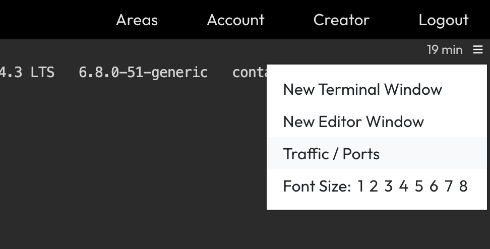
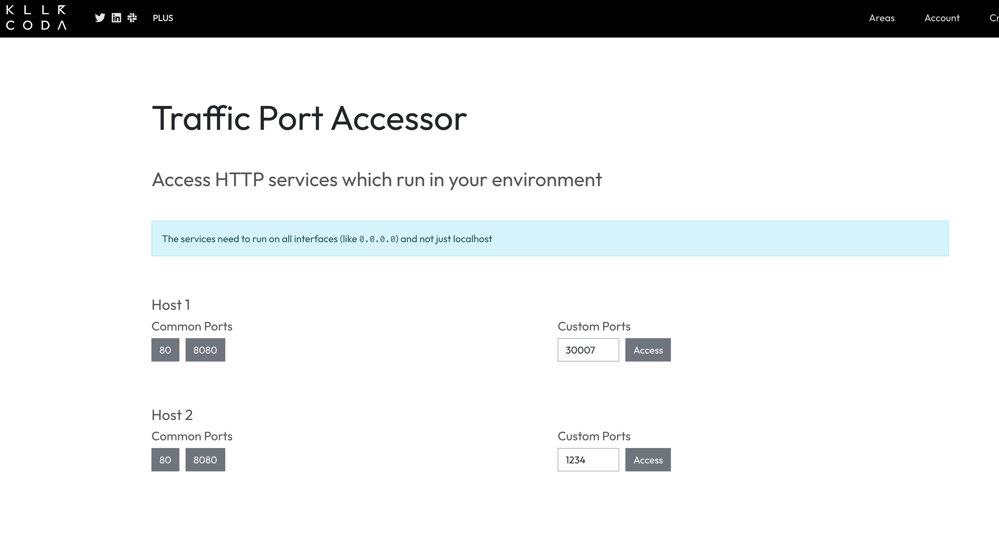
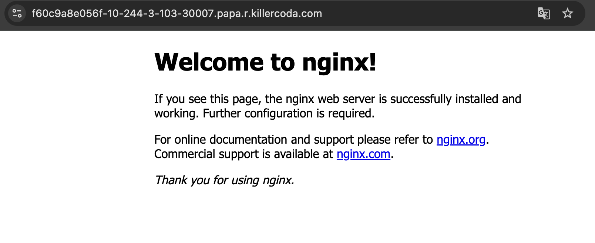

# 演習1 Kubernetes の基本操作

- [演習1 Kubernetes の基本操作](#演習1-kubernetes-の基本操作)
  - [1. 基本リソースの把握](#1-基本リソースの把握)
    - [1.1 Pod](#11-pod)
    - [1.2 Deployment](#12-deployment)
    - [1.3 Service](#13-service)
    - [1.4 Ingress](#14-ingress)
    - [1.5 環境のクリーンアップ](#15-環境のクリーンアップ)
  - [参考](#参考)
  - [次のステップ](#次のステップ)

Kubernetes の基本的なリソースについて理解しましょう。

演習環境にアクセスし、必要に応じて作業ディレクトリを作成してください。

```bash
mkdir ch01
cd ch01
```

## 1. 基本リソースの把握

### 1.1 Pod

以下のコマンドで Pod のマニフェストファイルを作成します。

```bash
cat <<EOF > myapp-pod.yaml
apiVersion: v1
kind: Pod
metadata:
  name: myapp
spec:
  containers:
  - name: nginx
    image: nginx:1.14.2
    ports:
    - containerPort: 80
EOF
```

次にマニフェストファイルから Pod を作成します。

```bash
kubectl apply -f myapp-pod.yaml
```

Pod が正常に作成・起動しているか確認してみます。<br/>
（コマンド末尾の `po` は `pod` の省略表記です）

```bash
kubectl get po
```

<details><summary>出力結果</summary>

```bash
NAME    READY   STATUS    RESTARTS   AGE
myapp   1/1     Running   0          12s
```

</details>

出力結果から、`myapp` という名前の Pod が1つ実行されていることが確認できました。

Pod の状態を見るには `describe` サブコマンド、Pod の構成情報を見るには `get` サブコマンドのオプションとして `-o yaml` を付与します。それぞれ出力結果を確認してみてください。

```bash
kubectl describe po myapp
```

<details><summary>出力結果</summary>

```bash
Name:             myapp
Namespace:        default
Priority:         0
Service Account:  default
Node:             node01/172.30.2.2
Start Time:       Fri, 26 Sep 2025 19:14:26 +0000
Labels:           <none>
Annotations:      cni.projectcalico.org/containerID: 36c2203b35d8770b4740ec74fe18e53118c5ab866760038587b33e92bb90a00d
                  cni.projectcalico.org/podIP: 192.168.1.4/32
                  cni.projectcalico.org/podIPs: 192.168.1.4/32
Status:           Running
IP:               192.168.1.4
IPs:
  IP:  192.168.1.4
Containers:
  nginx:
    Container ID:   containerd://20474a8986b507597f2792ab47a820827d667a981faaff880a4b72a734bc8beb
    Image:          nginx:1.14.2
    Image ID:       docker.io/library/nginx@sha256:f7988fb6c02e0ce69257d9bd9cf37ae20a60f1df7563c3a2a6abe24160306b8d
    Port:           80/TCP
    Host Port:      0/TCP
    State:          Running
      Started:      Fri, 26 Sep 2025 19:14:33 +0000
    Ready:          True
    Restart Count:  0
    Environment:    <none>
    Mounts:
      /var/run/secrets/kubernetes.io/serviceaccount from kube-api-access-s5lxw (ro)
Conditions:
  Type                        Status
  PodReadyToStartContainers   True 
  Initialized                 True 
  Ready                       True 
  ContainersReady             True 
  PodScheduled                True 
Volumes:
  kube-api-access-s5lxw:
    Type:                    Projected (a volume that contains injected data from multiple sources)
    TokenExpirationSeconds:  3607
    ConfigMapName:           kube-root-ca.crt
    Optional:                false
    DownwardAPI:             true
QoS Class:                   BestEffort
Node-Selectors:              <none>
Tolerations:                 node.kubernetes.io/not-ready:NoExecute op=Exists for 300s
                             node.kubernetes.io/unreachable:NoExecute op=Exists for 300s
Events:
  Type    Reason     Age   From               Message
  ----    ------     ----  ----               -------
  Normal  Scheduled  30s   default-scheduler  Successfully assigned default/myapp to node01
  Normal  Pulling    30s   kubelet            Pulling image "nginx:1.14.2"
  Normal  Pulled     24s   kubelet            Successfully pulled image "nginx:1.14.2" in 6.323s (6.323s including waiting). Image size: 44710204 bytes.
  Normal  Created    24s   kubelet            Created container: nginx
  Normal  Started    24s   kubelet            Started container nginx
```

</details>

```bash
kubectl get po myapp -o yaml
```

<details><summary>出力結果</summary>

```bash
apiVersion: v1
kind: Pod
metadata:
  annotations:
    cni.projectcalico.org/containerID: 36c2203b35d8770b4740ec74fe18e53118c5ab866760038587b33e92bb90a00d
    cni.projectcalico.org/podIP: 192.168.1.4/32
    cni.projectcalico.org/podIPs: 192.168.1.4/32
    kubectl.kubernetes.io/last-applied-configuration: |
      {"apiVersion":"v1","kind":"Pod","metadata":{"annotations":{},"name":"myapp","namespace":"default"},"spec":{"containers":[{"image":"nginx:1.14.2","name":"nginx","ports":[{"containerPort":80}]}]}}
  creationTimestamp: "2025-09-26T19:14:26Z"
  generation: 1
  name: myapp
  namespace: default
  resourceVersion: "5806"
  uid: 7f1d3f15-bb73-4e6f-8c6c-5df5ff3c4012
spec:
  containers:
  - image: nginx:1.14.2
    imagePullPolicy: IfNotPresent
    name: nginx
    ports:
    - containerPort: 80
      protocol: TCP
    resources: {}
    terminationMessagePath: /dev/termination-log
    terminationMessagePolicy: File
    volumeMounts:
    - mountPath: /var/run/secrets/kubernetes.io/serviceaccount
      name: kube-api-access-s5lxw
      readOnly: true
  dnsPolicy: ClusterFirst
  enableServiceLinks: true
  nodeName: node01
  preemptionPolicy: PreemptLowerPriority
  priority: 0
  restartPolicy: Always
  schedulerName: default-scheduler
  securityContext: {}
  serviceAccount: default
  serviceAccountName: default
  terminationGracePeriodSeconds: 30
  tolerations:
  - effect: NoExecute
    key: node.kubernetes.io/not-ready
    operator: Exists
    tolerationSeconds: 300
  - effect: NoExecute
    key: node.kubernetes.io/unreachable
    operator: Exists
    tolerationSeconds: 300
  volumes:
  - name: kube-api-access-s5lxw
    projected:
      defaultMode: 420
      sources:
      - serviceAccountToken:
          expirationSeconds: 3607
          path: token
      - configMap:
          items:
          - key: ca.crt
            path: ca.crt
          name: kube-root-ca.crt
      - downwardAPI:
          items:
          - fieldRef:
              apiVersion: v1
              fieldPath: metadata.namespace
            path: namespace
status:
  conditions:
  - lastProbeTime: null
    lastTransitionTime: "2025-09-26T19:14:34Z"
    status: "True"
    type: PodReadyToStartContainers
  - lastProbeTime: null
    lastTransitionTime: "2025-09-26T19:14:26Z"
    status: "True"
    type: Initialized
  - lastProbeTime: null
    lastTransitionTime: "2025-09-26T19:14:34Z"
    status: "True"
    type: Ready
  - lastProbeTime: null
    lastTransitionTime: "2025-09-26T19:14:34Z"
    status: "True"
    type: ContainersReady
  - lastProbeTime: null
    lastTransitionTime: "2025-09-26T19:14:26Z"
    status: "True"
    type: PodScheduled
  containerStatuses:
  - containerID: containerd://20474a8986b507597f2792ab47a820827d667a981faaff880a4b72a734bc8beb
    image: docker.io/library/nginx:1.14.2
    imageID: docker.io/library/nginx@sha256:f7988fb6c02e0ce69257d9bd9cf37ae20a60f1df7563c3a2a6abe24160306b8d
    lastState: {}
    name: nginx
    ready: true
    resources: {}
    restartCount: 0
    started: true
    state:
      running:
        startedAt: "2025-09-26T19:14:33Z"
    volumeMounts:
    - mountPath: /var/run/secrets/kubernetes.io/serviceaccount
      name: kube-api-access-s5lxw
      readOnly: true
      recursiveReadOnly: Disabled
  hostIP: 172.30.2.2
  hostIPs:
  - ip: 172.30.2.2
  phase: Running
  podIP: 192.168.1.4
  podIPs:
  - ip: 192.168.1.4
  qosClass: BestEffort
  startTime: "2025-09-26T19:14:26Z"
```

</details>

続いて myapp の nginx コンテナにアクセスしてみます。このコンテナは現状、クラスタ内からのみアクセス可能な状態になっています。クラスタ外からアクセスするために、今回は `kubectl port-forward` を利用します。

```bash
kubectl port-forward pods/myapp 8080:80 &
```

<details><summary>出力結果</summary>

```bash
[1] 23700
Forwarding from 127.0.0.1:8080 -> 80
Forwarding from [::1]:8080 -> 80
```

</details>

これで localhost 宛のリクエストをコンテナにフォワーディングすることができるようになりました。`curl` を実行すると nginx からレスポンスが返ってきます。

```bash
curl localhost:8080
```

<details><summary>出力結果</summary>

```bash
<!DOCTYPE html>
<html>
<head>
<title>Welcome to nginx!</title>
<style>
    body {
        width: 35em;
        margin: 0 auto;
        font-family: Tahoma, Verdana, Arial, sans-serif;
    }
</style>
</head>
<body>
<h1>Welcome to nginx!</h1>
<p>If you see this page, the nginx web server is successfully installed and
working. Further configuration is required.</p>

<p>For online documentation and support please refer to
<a href="http://nginx.org/">nginx.org</a>.<br/>
Commercial support is available at
<a href="http://nginx.com/">nginx.com</a>.</p>

<p><em>Thank you for using nginx.</em></p>
</body>
</html>
```

</details>

確認が終わったら、フォワーディングプロセスを停止してください。

```bash
kill %1
```

コンテナのログを見るには `kubectl logs` コマンドを実行します。以下のコマンドを実行すると、先ほど curl を実行した時のログが出力されます。

```bash
kubectl logs myapp
```

<details><summary>出力結果</summary>

```bash
127.0.0.1 - - [26/Sep/2025:19:19:18 +0000] "GET / HTTP/1.1" 200 612 "-" "curl/8.5.0" "-"
```

</details>

今度はコンテナ内でコマンドを実行してみましょう。これには `exec` サブコマンドを利用します。

```bash
kubectl exec -it myapp -- bash
```

プロンプトが変化していれば成功です。念のため、現在のホスト名を確認してみます。

```bash
cat /etc/hostname
```

ホスト名が `myapp` となっていれば、コンテナ内でコマンドを実行できています。<br/>
`kubectl exec` はデバッグ等で重宝する機能ですが、注意点としてコンテナ内に存在しないコマンドは実行できません。

試しに `ps` コマンドを実行してみると、次のようにエラーが返ってきます。

```bash
bash: ps: command not found
```

`exec` の確認はできたので、コンテナ内での処理を終了してください。

```bash
exit
```

現在ではデバッグ用のコマンド `kubectl debug` を利用することもできるので、デバッグ対象のコンテナに機能が足りない場合はこちらを利用すると良いです。<br/>
以下のデバッグコマンドを実行し、上記の操作をもう一度行ってみてください。

```bash
kubectl debug myapp -it --image=busybox --profile general
```

<details><summary>出力結果</summary>

```bash
Defaulting debug container name to debugger-fkd5p.
If you don't see a command prompt, try pressing enter.
```

</details>

`kubectl debug` は既存のPodに一時的なデバッグコンテナを追加する機能で、デバッグツールが不足している本来のコンテナの問題を回避できます。デバッグが完了したら `exit` で終了してください。

### 1.2 Deployment

Deployment は、Pod の管理を簡単にするための Kubernetes リソースです。Deployment を使用することで、指定した数の Pod が常に動作していることを保証し、Pod の更新やロールバックも容易に行えます。

まずはマニフェストファイルを作成し、リソースをクラスタにデプロイします。

```bash
cat <<EOF > myapp-deployment.yaml
apiVersion: apps/v1
kind: Deployment
metadata:
  name: myapp-deployment
  labels:
    app: myapp
spec:
  replicas: 3
  selector:
    matchLabels:
      app: myapp
  template:
    metadata:
      labels:
        app: myapp
    spec:
      containers:
      - name: nginx
        image: nginx:1.14.2
        ports:
        - containerPort: 80
EOF

kubectl apply -f myapp-deployment.yaml
```

続いて、作成したリソースを確認してみましょう。

```bash
kubectl get all -l app=myapp
```

<details><summary>出力結果</summary>

```bash
NAME                                   READY   STATUS    RESTARTS   AGE
pod/myapp-deployment-7d8c7cf59-6jfqq   1/1     Running   0          69s
pod/myapp-deployment-7d8c7cf59-l8zmt   1/1     Running   0          69s
pod/myapp-deployment-7d8c7cf59-tmzwl   1/1     Running   0          69s

NAME                               READY   UP-TO-DATE   AVAILABLE   AGE
deployment.apps/myapp-deployment   3/3     3            3           69s

NAME                                         DESIRED   CURRENT   READY   AGE
replicaset.apps/myapp-deployment-7d8c7cf59   3         3         3       69s
```

</details>

`kubectl get` の出力結果の通り、Deployment から1つの ReplicaSet と3つの Pod が作成されています。Deployment は ReplicaSet のバージョンを管理し、ReplicaSet は指定された数の Pod を作成します。

次に Deployment の更新を試してみましょう。以下のコマンドで、nginx コンテナのイメージを `nginx:1.16.1` にアップデートします。

```bash
kubectl set image deployment.v1.apps/myapp-deployment nginx=nginx:1.16.1
```

再度 `kubectl get all -l app=myapp` でリソースを確認してみます。

```bash
NAME                                    READY   STATUS    RESTARTS   AGE
pod/myapp-deployment-77d4bf446b-5zm7z   1/1     Running   0          2m30s
pod/myapp-deployment-77d4bf446b-6ngl8   1/1     Running   0          2m40s
pod/myapp-deployment-77d4bf446b-hb6db   1/1     Running   0          2m49s

NAME                               READY   UP-TO-DATE   AVAILABLE   AGE
deployment.apps/myapp-deployment   3/3     3            3           5m51s

NAME                                          DESIRED   CURRENT   READY   AGE
replicaset.apps/myapp-deployment-77d4bf446b   3         3         3       2m49s
replicaset.apps/myapp-deployment-7d8c7cf59    0         0         0       5m51s
```

新しい ReplicaSet (myapp-deployment-77d4bf446b) が作成され、Pod がすべて入れ替わりました。旧 ReplicaSet (myapp-deployment-7d8c7cf59) は Pod 数が0になっています。

Deployment の状態も確認してみましょう。

```bash
kubectl describe deploy myapp-deployment
```

<details><summary>出力結果</summary>

```bash
Name:                   myapp-deployment
Namespace:              default
CreationTimestamp:      Fri, 26 Sep 2025 19:32:10 +0000
Labels:                 app=myapp
Annotations:            deployment.kubernetes.io/revision: 2
Selector:               app=myapp
Replicas:               3 desired | 3 updated | 3 total | 3 available | 0 unavailable
StrategyType:           RollingUpdate
MinReadySeconds:        0
RollingUpdateStrategy:  25% max unavailable, 25% max surge
Pod Template:
  Labels:  app=myapp
  Containers:
   nginx:
    Image:         nginx:1.16.1
    Port:          80/TCP
    Host Port:     0/TCP
    Environment:   <none>
    Mounts:        <none>
  Volumes:         <none>
  Node-Selectors:  <none>
  Tolerations:     <none>
Conditions:
  Type           Status  Reason
  ----           ------  ------
  Available      True    MinimumReplicasAvailable
  Progressing    True    NewReplicaSetAvailable
OldReplicaSets:  myapp-deployment-7d8c7cf59 (0/0 replicas created)
NewReplicaSet:   myapp-deployment-77d4bf446b (3/3 replicas created)
Events:
  Type    Reason             Age    From                   Message
  ----    ------             ----   ----                   -------
  Normal  ScalingReplicaSet  7m29s  deployment-controller  Scaled up replica set myapp-deployment-7d8c7cf59 from 0 to 3
  Normal  ScalingReplicaSet  4m27s  deployment-controller  Scaled up replica set myapp-deployment-77d4bf446b from 0 to 1
  Normal  ScalingReplicaSet  4m18s  deployment-controller  Scaled down replica set myapp-deployment-7d8c7cf59 from 3 to 2
  Normal  ScalingReplicaSet  4m18s  deployment-controller  Scaled up replica set myapp-deployment-77d4bf446b from 1 to 2
  Normal  ScalingReplicaSet  4m8s   deployment-controller  Scaled down replica set myapp-deployment-7d8c7cf59 from 2 to 1
  Normal  ScalingReplicaSet  4m8s   deployment-controller  Scaled up replica set myapp-deployment-77d4bf446b from 2 to 3
  Normal  ScalingReplicaSet  4m7s   deployment-controller  Scaled down replica set myapp-deployment-7d8c7cf59 from 1 to 0
```

</details>

末尾のイベントログを見ると、Pod が1つずつ順番に再作成されていることがわかります。これは `StrategyType` が `RollingUpdate` となっているためです。一度に更新できる Pod 数は `RollingUpdateStrategy` の値により決定されます。

最後に、実行したアップデートを元に戻してみます。

```bash
kubectl rollout undo deployment myapp-deployment
```

もう一度 `kubectl get all -l app=myapp` を実行してください。

<details><summary>出力結果</summary>

```bash
NAME                                   READY   STATUS    RESTARTS   AGE
pod/myapp-deployment-7d8c7cf59-g6wq5   1/1     Running   0          102s
pod/myapp-deployment-7d8c7cf59-gpcxs   1/1     Running   0          100s
pod/myapp-deployment-7d8c7cf59-sfcbq   1/1     Running   0          101s

NAME                               READY   UP-TO-DATE   AVAILABLE   AGE
deployment.apps/myapp-deployment   3/3     3            3           10m

NAME                                          DESIRED   CURRENT   READY   AGE
replicaset.apps/myapp-deployment-77d4bf446b   0         0         0       7m51s
replicaset.apps/myapp-deployment-7d8c7cf59    3         3         3       10m
```

</details>

旧 ReplicaSet の Pod 数が3つ、新 ReplicaSet が0に更新されていることが確認できました。

### 1.3 Service

Service は、Kubernetes クラスタ内で動作する Pod に対するネットワークアクセスを提供するリソースです。Service を使用すると、Pod が再作成された場合でも、安定したIPアドレスを維持できます。

```bash
cat <<EOF > myapp-service.yaml
apiVersion: v1
kind: Service
metadata:
  name: myapp-service
spec:
  selector:
    app: myapp
  ports:
  - protocol: TCP
    port: 80
    targetPort: 80
EOF

kubectl apply -f myapp-service.yaml
```

上記マニフェストから作成したリソースを確認してみましょう。

```bash
kubectl get svc
```

<details><summary>出力結果</summary>

```bash
NAME            TYPE        CLUSTER-IP      EXTERNAL-IP   PORT(S)   AGE
kubernetes      ClusterIP   10.96.0.1       <none>        443/TCP   7d
myapp-service   ClusterIP   10.111.99.141   <none>        80/TCP    9s
```

</details>

myapp Pod にアクセスするための Service が作成されました。Service はクラスタ内で動作している Pod に安定したアクセスを提供し、負荷分散機能も提供します。外部からアクセスする場合は、`NodePort` または `LoadBalancer` タイプの Service を使用することもできます（デフォルトは `ClusterIP`）。

Serviceの各タイプの詳細については、[Kubernetesドキュメント](https://kubernetes.io/docs/concepts/services-networking/service/#publishing-services-service-types) を参照してください。

新しいマニフェストファイルを作成し、Service リソースを `NodePort` タイプに変更してみます。

```bash
cat <<EOF > myapp-service-nodeport.yaml
apiVersion: v1
kind: Service
metadata:
  name: myapp-service
spec:
  type: NodePort
  selector:
    app: myapp
  ports:
  - protocol: TCP
    port: 80
    targetPort: 80
    nodePort: 30007
EOF

kubectl apply -f myapp-service-nodeport.yaml
```

再度 `kubectl get svc` を実行します。

<details><summary>出力結果</summary>

```bash
NAME            TYPE        CLUSTER-IP      EXTERNAL-IP   PORT(S)        AGE
kubernetes      ClusterIP   10.96.0.1       <none>        443/TCP        7d
myapp-service   NodePort    10.111.99.141   <none>        80:30007/TCP   2m40s
```

</details>

Service タイプが `NodePort` になりました。これにより、ノードのIPアドレス宛のリクエストが Pod に届くようになります。

```bash
kubectl get no -o wide
```

<details><summary>出力結果</summary>

```bash
NAME                 STATUS   ROLES           AGE   VERSION   INTERNAL-IP   EXTERNAL-IP   OS-IMAGE                         KERNEL-VERSION   CONTAINER-RUNTIME
kind-control-plane   Ready    control-plane   4d    v1.30.0   172.18.0.2    <none>        Debian GNU/Linux 12 (bookworm)   6.5.0-1020-aws   containerd://1.7.15
kind-worker          Ready    <none>          4d    v1.30.0   172.18.0.3    <none>        Debian GNU/Linux 12 (bookworm)   6.5.0-1020-aws   containerd://1.7.15
kind-worker2         Ready    <none>          4d    v1.30.0   172.18.0.4    <none>        Debian GNU/Linux 12 (bookworm)   6.5.0-1020-aws   containerd://1.7.15
```

</details>

ノード情報を見ればノードのIPアドレスがわかるので、このIPアドレス宛にリクエストを送ってみます。

```bash
curl 172.30.1.2:30007
```

<details><summary>出力結果</summary>

```bash
<!DOCTYPE html>
<html>
<head>
<title>Welcome to nginx!</title>
<style>
    body {
        width: 35em;
        margin: 0 auto;
        font-family: Tahoma, Verdana, Arial, sans-serif;
    }
</style>
</head>
<body>
<h1>Welcome to nginx!</h1>
<p>If you see this page, the nginx web server is successfully installed and
working. Further configuration is required.</p>

<p>For online documentation and support please refer to
<a href="http://nginx.org/">nginx.org</a>.<br/>
Commercial support is available at
<a href="http://nginx.com/">nginx.com</a>.</p>

<p><em>Thank you for using nginx.</em></p>
</body>
</html>
```

</details>

nginx からレスポンスが返ってきました。クラスタ内のすべてのノード宛にリクエストを送信できます。

なお、Killercoda を使って演習を行っている場合、Traffic Port Accessor の機能でブラウザからアクセスすることも可能です。<br/>
ターミナル右上のオプションから、`Traffic / Ports` を選択します。



別タブでウィンドウが開くので、Custom Ports に `30007` を入力し Access をクリックしてください。



Nginx の画面が表示されれば成功です。



ローカルのKubernetesクラスタで演習を行っている場合も、ノードのIPを指定してブラウザからアクセス可能です。

### 1.4 Ingress

Ingress は、HTTP および HTTPS のリクエストをクラスタ内の Service にルーティングするためのリソースです。Ingress を使用することで、外部からのリクエストを特定の Service に振り分けることができます。

Ingress リソース自体は設定の定義のみを行い、実際のルーティング処理は Ingress Controller が担います。今回は NGINX Ingress Controller を使用します。

Ingress リソースを作成する前に、以下のコマンドで名前解決と Ingress コントローラーのインストールを行います。

```bash
echo "$(kubectl get nodes -o jsonpath='{.items[0].status.addresses[?(@.type=="InternalIP")].address}') myapp.seccamp.com" >> /etc/hosts

cat <<EOF > myapp-ingress.values.yaml
controller:
  ingressClassResource:
    default: true
  service:
    type: NodePort
    ports:
      http: 80
      https: 443
    nodePorts:
      http: 30080
      https: 30443
    targetPorts:
      http: http
      https: https
EOF

helm upgrade --install ingress-nginx ingress-nginx \
  --repo https://kubernetes.github.io/ingress-nginx \
  --namespace ingress-nginx --create-namespace \
  -f myapp-ingress.values.yaml
```

コントローラーのインストールには少し時間がかかります。

```bash
kubectl get po -n ingress-nginx
```

を実行し、Pod のステータスが `Running` になっていれば準備完了です。

続いて Ingress リソースを作成しましょう。

```bash
cat <<EOF > myapp-ingress.yaml
apiVersion: networking.k8s.io/v1
kind: Ingress
metadata:
  name: myapp-ingress
spec:
  rules:
  - host: myapp.seccamp.com
    http:
      paths:
      - path: /
        pathType: Prefix
        backend:
          service:
            name: myapp-service
            port:
              number: 80
EOF

kubectl apply -f myapp-ingress.yaml
```

これまで同様、`get` や `discribe` サブコマンドでリソースの状態を確認できます。

```bash
kubectl get ingress
```

<details><summary>出力結果</summary>

```bash
NAME            CLASS   HOSTS               ADDRESS       PORTS   AGE
myapp-ingress   nginx   myapp.seccamp.com   10.109.70.0   80      16m
```

</details>

```bash
kubectl get ingress myapp-ingress -o yaml
```

<details><summary>出力結果</summary>

```bash
apiVersion: networking.k8s.io/v1
kind: Ingress
metadata:
  annotations:
    kubectl.kubernetes.io/last-applied-configuration: |
      {"apiVersion":"networking.k8s.io/v1","kind":"Ingress","metadata":{"annotations":{},"name":"myapp-ingress","namespace":"default"},"spec":{"rules":[{"host":"myapp.seccamp.com","http":{"paths":[{"backend":{"service":{"name":"myapp-service","port":{"number":80}}},"path":"/","pathType":"Prefix"}]}}]}}
  creationTimestamp: "2025-09-26T20:21:10Z"
  generation: 1
  name: myapp-ingress
  namespace: default
  resourceVersion: "9435"
  uid: de63a92f-66aa-4a72-96b0-0ba49ae4437b
spec:
  ingressClassName: nginx
  rules:
  - host: myapp.seccamp.com
    http:
      paths:
      - backend:
          service:
            name: myapp-service
            port:
              number: 80
        path: /
        pathType: Prefix
status:
  loadBalancer:
    ingress:
    - ip: 10.109.70.0
```

</details>

```bash
kubectl describe ingress myapp-ingress
```

<details><summary>出力結果</summary>

```bash
Name:             myapp-ingress
Labels:           <none>
Namespace:        default
Address:          10.109.70.0
Ingress Class:    nginx
Default backend:  <default>
Rules:
  Host               Path  Backends
  ----               ----  --------
  myapp.seccamp.com  
                     /   myapp-service:80 (192.168.1.5:80,192.168.0.4:80,192.168.1.4:80)
Annotations:         <none>
Events:
  Type    Reason  Age                From                      Message
  ----    ------  ----               ----                      -------
  Normal  Sync    17m (x2 over 17m)  nginx-ingress-controller  Scheduled for sync
```

</details>

Ingress の作成後、`myapp.seccamp.com` にアクセスすると nginx-service にリクエストがルーティングされるようになります。

```bash
curl myapp.seccamp.com:30080
```

<details><summary>出力結果</summary>

```bash
<!DOCTYPE html>
<html>
<head>
<title>Welcome to nginx!</title>
<style>
    body {
        width: 35em;
        margin: 0 auto;
        font-family: Tahoma, Verdana, Arial, sans-serif;
    }
</style>
</head>
<body>
<h1>Welcome to nginx!</h1>
<p>If you see this page, the nginx web server is successfully installed and
working. Further configuration is required.</p>

<p>For online documentation and support please refer to
<a href="http://nginx.org/">nginx.org</a>.<br/>
Commercial support is available at
<a href="http://nginx.com/">nginx.com</a>.</p>

<p><em>Thank you for using nginx.</em></p>
</body>
</html>
```

</details>

### 1.5 環境のクリーンアップ

演習で作成したリソースを削除します。

```bash
kubectl delete po myapp
kubectl delete deploy myapp-deployment
kubectl delete svc myapp-service
kubectl delete ingress myapp-ingress
helm uninstall ingress-nginx -n ingress-nginx
kubectl delete ns ingress-nginx
```

ここで取り扱ったリソースは全体のごく一部です。他のリソースについても知りたい方は、[Kubernetes Docs](https://kubernetes.io/docs/concepts/) などを見ながらご自身で試してみてください。

## 参考

- https://kubernetes.io/docs/tutorials/kubernetes-basics/deploy-app/deploy-intro/
- https://kubernetes.io/docs/tutorials/kubernetes-basics/explore/explore-intro/
- https://kubernetes.io/docs/tutorials/kubernetes-basics/expose/expose-intro/
- https://kubernetes.io/docs/tutorials/kubernetes-basics/scale/scale-intro/
- https://kubernetes.io/docs/tutorials/kubernetes-basics/update/update-intro/

---

## 次のステップ

演習完了後、[2章 クラウドネイティブセキュリティ入門](../02_cloud_native_sec/README.md) に進みます。
