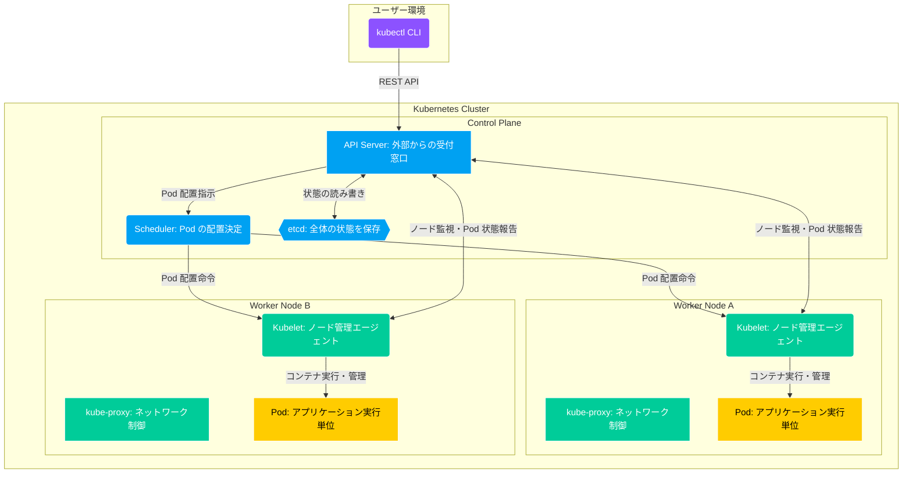

# 演習1 Kubernetes の基礎

- [演習1 Kubernetes の基礎](#演習1-kubernetes-の基礎)
  - [1. Kubernetes リソースの把握](#1-kubernetes-リソースの把握)
    - [1.1 Pod](#11-pod)
    - [1.2 Deployment](#12-deployment)
    - [1.3 Service](#13-service)
    - [1.4 Ingress](#14-ingress)
    - [1.5 まとめ](#15-まとめ)
  - [2. Kubernetes コンポーネントの把握](#2-kubernetes-コンポーネントの把握)
    - [2.1 コントロールプレーン](#21-コントロールプレーン)
      - [kube-apiserver](#kube-apiserver)
      - [etcd](#etcd)
      - [kube-controller-manager](#kube-controller-manager)
      - [kube-scheduler](#kube-scheduler)
    - [2.2 ワーカーノード](#22-ワーカーノード)
      - [kubelet](#kubelet)
      - [kube-proxy](#kube-proxy)
      - [コンテナランタイム](#コンテナランタイム)
    - [2.3 クラスタ構成の把握](#23-クラスタ構成の把握)
    - [2.4 まとめ](#24-まとめ)
  - [環境のクリーンアップ](#環境のクリーンアップ)
  - [参考](#参考)
  - [次のステップ](#次のステップ)

本演習を通して、Kubernetes の基礎を実践しながら理解しましょう。

演習環境にアクセスし、必要に応じて作業ディレクトリを作成してください。

```bash
mkdir ch01
cd ch01
```

## 1. Kubernetes リソースの把握

Kubernetes の基本的なリソースについて、実際に `kubectl` で操作しながら学習します。



### 1.1 Pod

まずは、以下のコマンドを実行し、Pod のマニフェストファイルを作成します。

```bash
cat <<EOF > myapp-pod.yaml
apiVersion: v1
kind: Pod
metadata:
  name: myapp
spec:
  containers:
  - name: nginx
    image: nginx:1.14.2
    ports:
    - containerPort: 80
EOF
```

次にマニフェストファイルから Pod を作成し、クラスタ内でアプリケーションを実行します。

```bash
kubectl apply -f myapp-pod.yaml
```

Pod が正常に作成・起動しているか確認してみます。<br/>
（コマンド末尾の `po` は `pod` の省略表記です）

```bash
kubectl get po
```

<details><summary>出力結果</summary>

```bash
NAME    READY   STATUS    RESTARTS   AGE
myapp   1/1     Running   0          12s
```

</details>

出力結果から、`myapp` という名前の Pod が1つ実行されていることが確認できました。

Pod の状態を見るには `describe` サブコマンド、Pod の構成情報を見るには `get` サブコマンドのオプションとして `-o yaml` を付与します。それぞれ出力結果を確認してみてください。

```bash
kubectl describe po myapp
```

<details><summary>出力結果</summary>

```bash
Name:             myapp
Namespace:        default
Priority:         0
Service Account:  default
Node:             node01/172.30.2.2
Start Time:       Fri, 26 Sep 2025 19:14:26 +0000
Labels:           <none>
Annotations:      cni.projectcalico.org/containerID: 36c2203b35d8770b4740ec74fe18e53118c5ab866760038587b33e92bb90a00d
                  cni.projectcalico.org/podIP: 192.168.1.4/32
                  cni.projectcalico.org/podIPs: 192.168.1.4/32
Status:           Running
IP:               192.168.1.4
IPs:
  IP:  192.168.1.4
Containers:
  nginx:
    Container ID:   containerd://20474a8986b507597f2792ab47a820827d667a981faaff880a4b72a734bc8beb
    Image:          nginx:1.14.2
    Image ID:       docker.io/library/nginx@sha256:f7988fb6c02e0ce69257d9bd9cf37ae20a60f1df7563c3a2a6abe24160306b8d
    Port:           80/TCP
    Host Port:      0/TCP
    State:          Running
      Started:      Fri, 26 Sep 2025 19:14:33 +0000
    Ready:          True
    Restart Count:  0
    Environment:    <none>
    Mounts:
      /var/run/secrets/kubernetes.io/serviceaccount from kube-api-access-s5lxw (ro)
Conditions:
  Type                        Status
  PodReadyToStartContainers   True 
  Initialized                 True 
  Ready                       True 
  ContainersReady             True 
  PodScheduled                True 
Volumes:
  kube-api-access-s5lxw:
    Type:                    Projected (a volume that contains injected data from multiple sources)
    TokenExpirationSeconds:  3607
    ConfigMapName:           kube-root-ca.crt
    Optional:                false
    DownwardAPI:             true
QoS Class:                   BestEffort
Node-Selectors:              <none>
Tolerations:                 node.kubernetes.io/not-ready:NoExecute op=Exists for 300s
                             node.kubernetes.io/unreachable:NoExecute op=Exists for 300s
Events:
  Type    Reason     Age   From               Message
  ----    ------     ----  ----               -------
  Normal  Scheduled  30s   default-scheduler  Successfully assigned default/myapp to node01
  Normal  Pulling    30s   kubelet            Pulling image "nginx:1.14.2"
  Normal  Pulled     24s   kubelet            Successfully pulled image "nginx:1.14.2" in 6.323s (6.323s including waiting). Image size: 44710204 bytes.
  Normal  Created    24s   kubelet            Created container: nginx
  Normal  Started    24s   kubelet            Started container nginx
```

</details>

```bash
kubectl get po myapp -o yaml
```

<details><summary>出力結果</summary>

```bash
apiVersion: v1
kind: Pod
metadata:
  annotations:
    cni.projectcalico.org/containerID: 36c2203b35d8770b4740ec74fe18e53118c5ab866760038587b33e92bb90a00d
    cni.projectcalico.org/podIP: 192.168.1.4/32
    cni.projectcalico.org/podIPs: 192.168.1.4/32
    kubectl.kubernetes.io/last-applied-configuration: |
      {"apiVersion":"v1","kind":"Pod","metadata":{"annotations":{},"name":"myapp","namespace":"default"},"spec":{"containers":[{"image":"nginx:1.14.2","name":"nginx","ports":[{"containerPort":80}]}]}}
  creationTimestamp: "2025-09-26T19:14:26Z"
  generation: 1
  name: myapp
  namespace: default
  resourceVersion: "5806"
  uid: 7f1d3f15-bb73-4e6f-8c6c-5df5ff3c4012
spec:
  containers:
  - image: nginx:1.14.2
    imagePullPolicy: IfNotPresent
    name: nginx
    ports:
    - containerPort: 80
      protocol: TCP
    resources: {}
    terminationMessagePath: /dev/termination-log
    terminationMessagePolicy: File
    volumeMounts:
    - mountPath: /var/run/secrets/kubernetes.io/serviceaccount
      name: kube-api-access-s5lxw
      readOnly: true
  dnsPolicy: ClusterFirst
  enableServiceLinks: true
  nodeName: node01
  preemptionPolicy: PreemptLowerPriority
  priority: 0
  restartPolicy: Always
  schedulerName: default-scheduler
  securityContext: {}
  serviceAccount: default
  serviceAccountName: default
  terminationGracePeriodSeconds: 30
  tolerations:
  - effect: NoExecute
    key: node.kubernetes.io/not-ready
    operator: Exists
    tolerationSeconds: 300
  - effect: NoExecute
    key: node.kubernetes.io/unreachable
    operator: Exists
    tolerationSeconds: 300
  volumes:
  - name: kube-api-access-s5lxw
    projected:
      defaultMode: 420
      sources:
      - serviceAccountToken:
          expirationSeconds: 3607
          path: token
      - configMap:
          items:
          - key: ca.crt
            path: ca.crt
          name: kube-root-ca.crt
      - downwardAPI:
          items:
          - fieldRef:
              apiVersion: v1
              fieldPath: metadata.namespace
            path: namespace
status:
  conditions:
  - lastProbeTime: null
    lastTransitionTime: "2025-09-26T19:14:34Z"
    status: "True"
    type: PodReadyToStartContainers
  - lastProbeTime: null
    lastTransitionTime: "2025-09-26T19:14:26Z"
    status: "True"
    type: Initialized
  - lastProbeTime: null
    lastTransitionTime: "2025-09-26T19:14:34Z"
    status: "True"
    type: Ready
  - lastProbeTime: null
    lastTransitionTime: "2025-09-26T19:14:34Z"
    status: "True"
    type: ContainersReady
  - lastProbeTime: null
    lastTransitionTime: "2025-09-26T19:14:26Z"
    status: "True"
    type: PodScheduled
  containerStatuses:
  - containerID: containerd://20474a8986b507597f2792ab47a820827d667a981faaff880a4b72a734bc8beb
    image: docker.io/library/nginx:1.14.2
    imageID: docker.io/library/nginx@sha256:f7988fb6c02e0ce69257d9bd9cf37ae20a60f1df7563c3a2a6abe24160306b8d
    lastState: {}
    name: nginx
    ready: true
    resources: {}
    restartCount: 0
    started: true
    state:
      running:
        startedAt: "2025-09-26T19:14:33Z"
    volumeMounts:
    - mountPath: /var/run/secrets/kubernetes.io/serviceaccount
      name: kube-api-access-s5lxw
      readOnly: true
      recursiveReadOnly: Disabled
  hostIP: 172.30.2.2
  hostIPs:
  - ip: 172.30.2.2
  phase: Running
  podIP: 192.168.1.4
  podIPs:
  - ip: 192.168.1.4
  qosClass: BestEffort
  startTime: "2025-09-26T19:14:26Z"
```

</details>

続いて myapp の nginx コンテナにアクセスしてみます。このコンテナは現状、クラスタ内からのみアクセス可能な状態になっています。クラスタ外からアクセスするために、今回は `kubectl port-forward` を利用します。

```bash
kubectl port-forward pods/myapp 8080:80 &
```

<details><summary>出力結果</summary>

```bash
[1] 23700
Forwarding from 127.0.0.1:8080 -> 80
Forwarding from [::1]:8080 -> 80
```

</details>

これで localhost 宛のリクエストをコンテナにフォワーディングすることができるようになりました。`curl` を実行すると nginx からレスポンスが返ってきます。

```bash
curl localhost:8080
```

<details><summary>出力結果</summary>

```bash
<!DOCTYPE html>
<html>
<head>
<title>Welcome to nginx!</title>
<style>
    body {
        width: 35em;
        margin: 0 auto;
        font-family: Tahoma, Verdana, Arial, sans-serif;
    }
</style>
</head>
<body>
<h1>Welcome to nginx!</h1>
<p>If you see this page, the nginx web server is successfully installed and
working. Further configuration is required.</p>

<p>For online documentation and support please refer to
<a href="http://nginx.org/">nginx.org</a>.<br/>
Commercial support is available at
<a href="http://nginx.com/">nginx.com</a>.</p>

<p><em>Thank you for using nginx.</em></p>
</body>
</html>
```

</details>

確認が終わったら、フォワーディングプロセスを停止してください。

```bash
kill %1
```

コンテナのログを見るには `kubectl logs` コマンドを実行します。以下のコマンドを実行すると、先ほど curl を実行した時のログが出力されます。

```bash
kubectl logs myapp
```

<details><summary>出力結果</summary>

```bash
127.0.0.1 - - [26/Sep/2025:19:19:18 +0000] "GET / HTTP/1.1" 200 612 "-" "curl/8.5.0" "-"
```

</details>

今度はコンテナ内でコマンドを実行してみましょう。これには `exec` サブコマンドを利用します。

```bash
kubectl exec -it myapp -- bash
```

プロンプトが変化していれば成功です。念のため、現在のホスト名を確認してみます。

```bash
cat /etc/hostname
```

ホスト名が `myapp` となっていれば、コンテナ内でコマンドを実行できています。<br/>
`kubectl exec` はデバッグ等で重宝する機能ですが、注意点としてコンテナ内に存在しないコマンドは実行できません。

試しに `ps` コマンドを実行してみると、次のようにエラーが返ってきます。

```bash
bash: ps: command not found
```

`exec` の確認はできたので、コンテナ内での処理を終了してください。

```bash
exit
```

現在ではデバッグ用のコマンド `kubectl debug` を利用することもできるので、デバッグ対象のコンテナに機能が足りない場合はこちらを利用すると良いです。<br/>
以下のデバッグコマンドを実行し、上記の操作をもう一度行ってみてください。

```bash
kubectl debug myapp -it --image=busybox --profile general
```

<details><summary>出力結果</summary>

```bash
Defaulting debug container name to debugger-fkd5p.
If you don't see a command prompt, try pressing enter.
```

</details>

`kubectl debug` は既存のPodに一時的なデバッグコンテナを追加する機能で、デバッグツールが不足している本来のコンテナの問題を回避できます。デバッグが完了したら `exit` で終了してください。

### 1.2 Deployment

Deployment は、Pod の管理を簡単にするための Kubernetes リソースです。Deployment を使用することで、指定した数の Pod が常に動作していることを保証し、Pod の更新やロールバックも容易に行えます。

まずはマニフェストファイルを作成し、リソースをクラスタにデプロイします。

```bash
cat <<EOF > myapp-deployment.yaml
apiVersion: apps/v1
kind: Deployment
metadata:
  name: myapp-deployment
  labels:
    app: myapp
spec:
  replicas: 3
  selector:
    matchLabels:
      app: myapp
  template:
    metadata:
      labels:
        app: myapp
    spec:
      containers:
      - name: nginx
        image: nginx:1.14.2
        ports:
        - containerPort: 80
EOF

kubectl apply -f myapp-deployment.yaml
```

続いて、作成したリソースを確認してみましょう。

```bash
kubectl get all -l app=myapp
```

<details><summary>出力結果</summary>

```bash
NAME                                   READY   STATUS    RESTARTS   AGE
pod/myapp-deployment-7d8c7cf59-6jfqq   1/1     Running   0          69s
pod/myapp-deployment-7d8c7cf59-l8zmt   1/1     Running   0          69s
pod/myapp-deployment-7d8c7cf59-tmzwl   1/1     Running   0          69s

NAME                               READY   UP-TO-DATE   AVAILABLE   AGE
deployment.apps/myapp-deployment   3/3     3            3           69s

NAME                                         DESIRED   CURRENT   READY   AGE
replicaset.apps/myapp-deployment-7d8c7cf59   3         3         3       69s
```

</details>

`kubectl get` の出力結果の通り、Deployment から1つの ReplicaSet と3つの Pod が作成されています。Deployment は ReplicaSet のバージョンを管理し、ReplicaSet は指定された数の Pod を作成します。

次に Deployment の更新を試してみましょう。以下のコマンドで、nginx コンテナのイメージを `nginx:1.16.1` にアップデートします。

```bash
kubectl set image deployment.v1.apps/myapp-deployment nginx=nginx:1.16.1
```

再度 `kubectl get all -l app=myapp` でリソースを確認してみます。

```bash
NAME                                    READY   STATUS    RESTARTS   AGE
pod/myapp-deployment-77d4bf446b-5zm7z   1/1     Running   0          2m30s
pod/myapp-deployment-77d4bf446b-6ngl8   1/1     Running   0          2m40s
pod/myapp-deployment-77d4bf446b-hb6db   1/1     Running   0          2m49s

NAME                               READY   UP-TO-DATE   AVAILABLE   AGE
deployment.apps/myapp-deployment   3/3     3            3           5m51s

NAME                                          DESIRED   CURRENT   READY   AGE
replicaset.apps/myapp-deployment-77d4bf446b   3         3         3       2m49s
replicaset.apps/myapp-deployment-7d8c7cf59    0         0         0       5m51s
```

新しい ReplicaSet (myapp-deployment-77d4bf446b) が作成され、Pod がすべて入れ替わりました。旧 ReplicaSet (myapp-deployment-7d8c7cf59) は Pod 数が0になっています。

Deployment の状態も確認してみましょう。

```bash
kubectl describe deploy myapp-deployment
```

<details><summary>出力結果</summary>

```bash
Name:                   myapp-deployment
Namespace:              default
CreationTimestamp:      Fri, 26 Sep 2025 19:32:10 +0000
Labels:                 app=myapp
Annotations:            deployment.kubernetes.io/revision: 2
Selector:               app=myapp
Replicas:               3 desired | 3 updated | 3 total | 3 available | 0 unavailable
StrategyType:           RollingUpdate
MinReadySeconds:        0
RollingUpdateStrategy:  25% max unavailable, 25% max surge
Pod Template:
  Labels:  app=myapp
  Containers:
   nginx:
    Image:         nginx:1.16.1
    Port:          80/TCP
    Host Port:     0/TCP
    Environment:   <none>
    Mounts:        <none>
  Volumes:         <none>
  Node-Selectors:  <none>
  Tolerations:     <none>
Conditions:
  Type           Status  Reason
  ----           ------  ------
  Available      True    MinimumReplicasAvailable
  Progressing    True    NewReplicaSetAvailable
OldReplicaSets:  myapp-deployment-7d8c7cf59 (0/0 replicas created)
NewReplicaSet:   myapp-deployment-77d4bf446b (3/3 replicas created)
Events:
  Type    Reason             Age    From                   Message
  ----    ------             ----   ----                   -------
  Normal  ScalingReplicaSet  7m29s  deployment-controller  Scaled up replica set myapp-deployment-7d8c7cf59 from 0 to 3
  Normal  ScalingReplicaSet  4m27s  deployment-controller  Scaled up replica set myapp-deployment-77d4bf446b from 0 to 1
  Normal  ScalingReplicaSet  4m18s  deployment-controller  Scaled down replica set myapp-deployment-7d8c7cf59 from 3 to 2
  Normal  ScalingReplicaSet  4m18s  deployment-controller  Scaled up replica set myapp-deployment-77d4bf446b from 1 to 2
  Normal  ScalingReplicaSet  4m8s   deployment-controller  Scaled down replica set myapp-deployment-7d8c7cf59 from 2 to 1
  Normal  ScalingReplicaSet  4m8s   deployment-controller  Scaled up replica set myapp-deployment-77d4bf446b from 2 to 3
  Normal  ScalingReplicaSet  4m7s   deployment-controller  Scaled down replica set myapp-deployment-7d8c7cf59 from 1 to 0
```

</details>

末尾のイベントログを見ると、Pod が1つずつ順番に再作成されていることがわかります。これは `StrategyType` が `RollingUpdate` となっているためです。一度に更新できる Pod 数は `RollingUpdateStrategy` の値により決定されます。

最後に、実行したアップデートを元に戻してみます。

```bash
kubectl rollout undo deployment myapp-deployment
```

もう一度 `kubectl get all -l app=myapp` を実行してください。

<details><summary>出力結果</summary>

```bash
NAME                                   READY   STATUS    RESTARTS   AGE
pod/myapp-deployment-7d8c7cf59-g6wq5   1/1     Running   0          102s
pod/myapp-deployment-7d8c7cf59-gpcxs   1/1     Running   0          100s
pod/myapp-deployment-7d8c7cf59-sfcbq   1/1     Running   0          101s

NAME                               READY   UP-TO-DATE   AVAILABLE   AGE
deployment.apps/myapp-deployment   3/3     3            3           10m

NAME                                          DESIRED   CURRENT   READY   AGE
replicaset.apps/myapp-deployment-77d4bf446b   0         0         0       7m51s
replicaset.apps/myapp-deployment-7d8c7cf59    3         3         3       10m
```

</details>

旧 ReplicaSet の Pod 数が3つ、新 ReplicaSet が0に更新されていることが確認できました。

### 1.3 Service

Service は、Kubernetes クラスタ内で動作する Pod に対するネットワークアクセスを提供するリソースです。Service を使用すると、Pod が再作成された場合でも、安定したIPアドレスを維持できます。

```bash
cat <<EOF > myapp-service.yaml
apiVersion: v1
kind: Service
metadata:
  name: myapp-service
spec:
  selector:
    app: myapp
  ports:
  - protocol: TCP
    port: 80
    targetPort: 80
EOF

kubectl apply -f myapp-service.yaml
```

上記マニフェストから作成したリソースを確認してみましょう。

```bash
kubectl get svc
```

<details><summary>出力結果</summary>

```bash
NAME            TYPE        CLUSTER-IP      EXTERNAL-IP   PORT(S)   AGE
kubernetes      ClusterIP   10.96.0.1       <none>        443/TCP   7d
myapp-service   ClusterIP   10.111.99.141   <none>        80/TCP    9s
```

</details>

myapp Pod にアクセスするための Service が作成されました。Service はクラスタ内で動作している Pod に安定したアクセスを提供し、負荷分散機能も提供します。外部からアクセスする場合は、`NodePort` または `LoadBalancer` タイプの Service を使用することもできます（デフォルトは `ClusterIP`）。

Serviceの各タイプの詳細については、[Kubernetesドキュメント](https://kubernetes.io/docs/concepts/services-networking/service/#publishing-services-service-types) を参照してください。

新しいマニフェストファイルを作成し、Service リソースを `NodePort` タイプに変更してみます。

```bash
cat <<EOF > myapp-service-nodeport.yaml
apiVersion: v1
kind: Service
metadata:
  name: myapp-service
spec:
  type: NodePort
  selector:
    app: myapp
  ports:
  - protocol: TCP
    port: 80
    targetPort: 80
    nodePort: 30007
EOF

kubectl apply -f myapp-service-nodeport.yaml
```

再度 `kubectl get svc` を実行します。

<details><summary>出力結果</summary>

```bash
NAME            TYPE        CLUSTER-IP      EXTERNAL-IP   PORT(S)        AGE
kubernetes      ClusterIP   10.96.0.1       <none>        443/TCP        7d
myapp-service   NodePort    10.111.99.141   <none>        80:30007/TCP   2m40s
```

</details>

Service タイプが `NodePort` になりました。これにより、ノードのIPアドレス宛のリクエストが Pod に届くようになります。

```bash
kubectl get no -o wide
```

<details><summary>出力結果</summary>

```bash
NAME                 STATUS   ROLES           AGE   VERSION   INTERNAL-IP   EXTERNAL-IP   OS-IMAGE                         KERNEL-VERSION   CONTAINER-RUNTIME
kind-control-plane   Ready    control-plane   4d    v1.30.0   172.18.0.2    <none>        Debian GNU/Linux 12 (bookworm)   6.5.0-1020-aws   containerd://1.7.15
kind-worker          Ready    <none>          4d    v1.30.0   172.18.0.3    <none>        Debian GNU/Linux 12 (bookworm)   6.5.0-1020-aws   containerd://1.7.15
kind-worker2         Ready    <none>          4d    v1.30.0   172.18.0.4    <none>        Debian GNU/Linux 12 (bookworm)   6.5.0-1020-aws   containerd://1.7.15
```

</details>

ノード情報を見ればノードのIPアドレスがわかるので、このIPアドレス宛にリクエストを送ってみます。

```bash
curl 172.30.1.2:30007
```

<details><summary>出力結果</summary>

```bash
<!DOCTYPE html>
<html>
<head>
<title>Welcome to nginx!</title>
<style>
    body {
        width: 35em;
        margin: 0 auto;
        font-family: Tahoma, Verdana, Arial, sans-serif;
    }
</style>
</head>
<body>
<h1>Welcome to nginx!</h1>
<p>If you see this page, the nginx web server is successfully installed and
working. Further configuration is required.</p>

<p>For online documentation and support please refer to
<a href="http://nginx.org/">nginx.org</a>.<br/>
Commercial support is available at
<a href="http://nginx.com/">nginx.com</a>.</p>

<p><em>Thank you for using nginx.</em></p>
</body>
</html>
```

</details>

nginx からレスポンスが返ってきました。クラスタ内のすべてのノード宛にリクエストを送信できます。

なお、Killercoda を使って演習を行っている場合、Traffic Port Accessor の機能でブラウザからアクセスすることも可能です。<br/>
ターミナル右上のオプションから、`Traffic / Ports` を選択します。


別タブでウィンドウが開くので、Custom Ports に `30007` を入力し Access をクリックしてください。


Nginx の画面が表示されれば成功です。


ローカルのKubernetesクラスタで演習を行っている場合も、ノードのIPを指定してブラウザからアクセス可能です。

### 1.4 Ingress

Ingress は、HTTP および HTTPS のリクエストをクラスタ内の Service にルーティングするためのリソースです。Ingress を使用することで、外部からのリクエストを特定の Service に振り分けることができます。

Ingress リソース自体は設定の定義のみを行い、実際のルーティング処理は Ingress Controller が担います。今回は NGINX Ingress Controller を使用します。

Ingress リソースを作成する前に、以下のコマンドで名前解決と Ingress コントローラーのインストールを行います。

```bash
echo "$(kubectl get nodes -o jsonpath='{.items[0].status.addresses[?(@.type=="InternalIP")].address}') myapp.seccamp.com" >> /etc/hosts

cat <<EOF > myapp-ingress.values.yaml
controller:
  ingressClassResource:
    default: true
  service:
    type: NodePort
    ports:
      http: 80
      https: 443
    nodePorts:
      http: 30080
      https: 30443
    targetPorts:
      http: http
      https: https
EOF

helm upgrade --install ingress-nginx ingress-nginx \
  --repo https://kubernetes.github.io/ingress-nginx \
  --namespace ingress-nginx --create-namespace \
  -f myapp-ingress.values.yaml
```

コントローラーのインストールには少し時間がかかります。

```bash
kubectl get po -n ingress-nginx
```

を実行し、Pod のステータスが `Running` になっていれば準備完了です。

続いて Ingress リソースを作成しましょう。

```bash
cat <<EOF > myapp-ingress.yaml
apiVersion: networking.k8s.io/v1
kind: Ingress
metadata:
  name: myapp-ingress
spec:
  rules:
  - host: myapp.seccamp.com
    http:
      paths:
      - path: /
        pathType: Prefix
        backend:
          service:
            name: myapp-service
            port:
              number: 80
EOF

kubectl apply -f myapp-ingress.yaml
```

これまで同様、`get` や `discribe` サブコマンドでリソースの状態を確認できます。

```bash
kubectl get ingress
```

<details><summary>出力結果</summary>

```bash
NAME            CLASS   HOSTS               ADDRESS       PORTS   AGE
myapp-ingress   nginx   myapp.seccamp.com   10.109.70.0   80      16m
```

</details>

```bash
kubectl get ingress myapp-ingress -o yaml
```

<details><summary>出力結果</summary>

```bash
apiVersion: networking.k8s.io/v1
kind: Ingress
metadata:
  annotations:
    kubectl.kubernetes.io/last-applied-configuration: |
      {"apiVersion":"networking.k8s.io/v1","kind":"Ingress","metadata":{"annotations":{},"name":"myapp-ingress","namespace":"default"},"spec":{"rules":[{"host":"myapp.seccamp.com","http":{"paths":[{"backend":{"service":{"name":"myapp-service","port":{"number":80}}},"path":"/","pathType":"Prefix"}]}}]}}
  creationTimestamp: "2025-09-26T20:21:10Z"
  generation: 1
  name: myapp-ingress
  namespace: default
  resourceVersion: "9435"
  uid: de63a92f-66aa-4a72-96b0-0ba49ae4437b
spec:
  ingressClassName: nginx
  rules:
  - host: myapp.seccamp.com
    http:
      paths:
      - backend:
          service:
            name: myapp-service
            port:
              number: 80
        path: /
        pathType: Prefix
status:
  loadBalancer:
    ingress:
    - ip: 10.109.70.0
```

</details>

```bash
kubectl describe ingress myapp-ingress
```

<details><summary>出力結果</summary>

```bash
Name:             myapp-ingress
Labels:           <none>
Namespace:        default
Address:          10.109.70.0
Ingress Class:    nginx
Default backend:  <default>
Rules:
  Host               Path  Backends
  ----               ----  --------
  myapp.seccamp.com  
                     /   myapp-service:80 (192.168.1.5:80,192.168.0.4:80,192.168.1.4:80)
Annotations:         <none>
Events:
  Type    Reason  Age                From                      Message
  ----    ------  ----               ----                      -------
  Normal  Sync    17m (x2 over 17m)  nginx-ingress-controller  Scheduled for sync
```

</details>

Ingress の作成後、`myapp.seccamp.com` にアクセスすると nginx-service にリクエストがルーティングされるようになります。

```bash
curl myapp.seccamp.com:30080
```

<details><summary>出力結果</summary>

```bash
<!DOCTYPE html>
<html>
<head>
<title>Welcome to nginx!</title>
<style>
    body {
        width: 35em;
        margin: 0 auto;
        font-family: Tahoma, Verdana, Arial, sans-serif;
    }
</style>
</head>
<body>
<h1>Welcome to nginx!</h1>
<p>If you see this page, the nginx web server is successfully installed and
working. Further configuration is required.</p>

<p>For online documentation and support please refer to
<a href="http://nginx.org/">nginx.org</a>.<br/>
Commercial support is available at
<a href="http://nginx.com/">nginx.com</a>.</p>

<p><em>Thank you for using nginx.</em></p>
</body>
</html>
```

</details>

### 1.5 まとめ

ここで取り扱ったリソースは全体のごく一部です。他のリソースについても知りたい方は、[Kubernetes Docs](https://kubernetes.io/docs/concepts/) などを見ながらご自身で試してみてください。

## 2. Kubernetes コンポーネントの把握

※「1. 基本リソースの把握」が早めに終わった方はチャレンジしてみてください。

Kubernetes についてより深く理解するため、クラスタを構成するコンポーネントをそれぞれ見ていきましょう。

事前準備として、クラスタのノード構成を把握します。

```bash
kubectl get nodes -o wide
```

<details><summary>出力結果</summary>

```bash
NAME           STATUS   ROLES           AGE   VERSION   INTERNAL-IP   EXTERNAL-IP   OS-IMAGE             KERNEL-VERSION     CONTAINER-RUNTIME
controlplane   Ready    control-plane   8d    v1.33.2   172.30.1.2    <none>        Ubuntu 24.04.3 LTS   6.8.0-51-generic   containerd://1.7.27
node01         Ready    <none>          8d    v1.33.2   172.30.2.2    <none>        Ubuntu 24.04.3 LTS   6.8.0-51-generic   containerd://1.7.27
```

</details>

出力結果から、このクラスタは2つのノードで構成されていることがわかりました。

- コントロールプレーン: controlplane
- ワーカーノード: node01

### 2.1 コントロールプレーン

コントロールプレーンのノード（VM）に入り、動作しているコンポーネントを調べてみます。<br/>
Killercoda を利用している場合は、ターミナル起動時にすでにコントロールプレーンの中にいる状態です。

まずはプロセスを確認します。

```bash
ps aux | grep -v grep | grep kube
```

<details><summary>出力結果</summary>

```bash
root        1653  1.0  3.3 1910608 73600 ?       Ssl  15:42   0:10 /usr/bin/kubelet --bootstrap-kubeconfig=/etc/kubernetes/bootstrap-kubelet.conf --kubeconfig=/etc/kubernetes/kubelet.conf --config=/var/lib/kubelet/config.yaml --container-runtime-endpoint=unix:///var/run/containerd/containerd.sock --pod-infra-container-image=registry.k8s.io/pause:3.10 --container-runtime-endpoint unix:///run/containerd/containerd.sock --cgroup-driver=systemd --eviction-hard imagefs.available<5%,memory.available<100Mi,nodefs.available<5% --fail-swap-on=false
root        1902  2.1 12.0 1526700 265532 ?      Ssl  15:42   0:20 kube-apiserver --advertise-address=172.30.1.2 --allow-privileged=true --authorization-mode=Node,RBAC --client-ca-file=/etc/kubernetes/pki/ca.crt --enable-admission-plugins=NodeRestriction --enable-bootstrap-token-auth=true --etcd-cafile=/etc/kubernetes/pki/etcd/ca.crt --etcd-certfile=/etc/kubernetes/pki/apiserver-etcd-client.crt --etcd-keyfile=/etc/kubernetes/pki/apiserver-etcd-client.key --etcd-servers=https://127.0.0.1:2379 --kubelet-client-certificate=/etc/kubernetes/pki/apiserver-kubelet-client.crt --kubelet-client-key=/etc/kubernetes/pki/apiserver-kubelet-client.key --kubelet-preferred-address-types=InternalIP,ExternalIP,Hostname --proxy-client-cert-file=/etc/kubernetes/pki/front-proxy-client.crt --proxy-client-key-file=/etc/kubernetes/pki/front-proxy-client.key --requestheader-allowed-names=front-proxy-client --requestheader-client-ca-file=/etc/kubernetes/pki/front-proxy-ca.crt --requestheader-extra-headers-prefix=X-Remote-Extra- --requestheader-group-headers=X-Remote-Group --requestheader-username-headers=X-Remote-User --secure-port=6443 --service-account-issuer=https://kubernetes.default.svc.cluster.local --service-account-key-file=/etc/kubernetes/pki/sa.pub --service-account-signing-key-file=/etc/kubernetes/pki/sa.key --service-cluster-ip-range=10.96.0.0/12 --tls-cert-file=/etc/kubernetes/pki/apiserver.crt --tls-private-key-file=/etc/kubernetes/pki/apiserver.key
root        1934  1.0  2.6 11737744 59008 ?      Ssl  15:42   0:09 etcd --advertise-client-urls=https://172.30.1.2:2379 --cert-file=/etc/kubernetes/pki/etcd/server.crt --client-cert-auth=true --data-dir=/var/lib/etcd --experimental-initial-corrupt-check=true --experimental-watch-progress-notify-interval=5s --initial-advertise-peer-urls=https://172.30.1.2:2380 --initial-cluster=controlplane=https://172.30.1.2:2380 --key-file=/etc/kubernetes/pki/etcd/server.key --listen-client-urls=https://127.0.0.1:2379,https://172.30.1.2:2379 --listen-metrics-urls=http://127.0.0.1:2381 --listen-peer-urls=https://172.30.1.2:2380 --name=controlplane --peer-cert-file=/etc/kubernetes/pki/etcd/peer.crt --peer-client-cert-auth=true --peer-key-file=/etc/kubernetes/pki/etcd/peer.key --peer-trusted-ca-file=/etc/kubernetes/pki/etcd/ca.crt --snapshot-count=10000 --trusted-ca-file=/etc/kubernetes/pki/etcd/ca.crt
root        1960  0.7  4.0 1317660 89728 ?       Ssl  15:42   0:07 kube-controller-manager --allocate-node-cidrs=true --authentication-kubeconfig=/etc/kubernetes/controller-manager.conf --authorization-kubeconfig=/etc/kubernetes/controller-manager.conf --bind-address=127.0.0.1 --client-ca-file=/etc/kubernetes/pki/ca.crt --cluster-cidr=192.168.0.0/16 --cluster-name=kubernetes --cluster-signing-cert-file=/etc/kubernetes/pki/ca.crt --cluster-signing-key-file=/etc/kubernetes/pki/ca.key --controllers=*,bootstrapsigner,tokencleaner --kubeconfig=/etc/kubernetes/controller-manager.conf --leader-elect=true --requestheader-client-ca-file=/etc/kubernetes/pki/front-proxy-ca.crt --root-ca-file=/etc/kubernetes/pki/ca.crt --service-account-private-key-file=/etc/kubernetes/pki/sa.key --service-cluster-ip-range=10.96.0.0/12 --use-service-account-credentials=true
root        1987  0.4  1.7 1296012 39296 ?       Ssl  15:42   0:04 kube-scheduler --authentication-kubeconfig=/etc/kubernetes/scheduler.conf --authorization-kubeconfig=/etc/kubernetes/scheduler.conf --bind-address=127.0.0.1 --kubeconfig=/etc/kubernetes/scheduler.conf --leader-elect=true
root        2861  0.0  2.6 1296728 58176 ?       Ssl  15:42   0:00 /usr/local/bin/kube-proxy --config=/var/lib/kube-proxy/config.conf --hostname-override=controlplane
root        3260  0.0  1.6 1269604 36992 ?       Ssl  15:42   0:00 /opt/bin/flanneld --ip-masq --kube-subnet-mgr
dnsmasq     3879  0.0  1.9 1051468 42312 ?       Ssl  15:43   0:00 /usr/bin/kube-controllers
```

</details>

今度は `kubectl` コマンドを実行し、コントロールプレーンで動作するシステムコンポーネント（Pod）の一覧を表示します。

```bash
kubectl get po -n kube-system -o wide | grep controlplane
```


<details><summary>出力結果</summary>

```bash
calico-kube-controllers-fdf5f5495-vxpw5   1/1     Running   2 (66m ago)   8d    192.168.0.2   controlplane   <none>           <none>
canal-wlt99                               2/2     Running   2 (66m ago)   8d    172.30.1.2    controlplane   <none>           <none>
etcd-controlplane                         1/1     Running   3 (66m ago)   8d    172.30.1.2    controlplane   <none>           <none>
kube-apiserver-controlplane               1/1     Running   3 (66m ago)   8d    172.30.1.2    controlplane   <none>           <none>
kube-controller-manager-controlplane      1/1     Running   2 (66m ago)   8d    172.30.1.2    controlplane   <none>           <none>
kube-proxy-txl4k                          1/1     Running   2 (66m ago)   8d    172.30.1.2    controlplane   <none>           <none>
kube-scheduler-controlplane               1/1     Running   2 (66m ago)   8d    172.30.1.2    controlplane   <none>           <none>
```

</details>


これらの出力結果から、以下の Kubernetes 関連プロセスが動作していることがわかります。

- kubelet
- kube-apiserver
- etcd
- kube-controller-manager
- kube-scheduler
- kube-proxy
- flanneld
- calico-kube-controllers
- canal

ここでは、この中からコントロールプレーンを構成するコンポーネントを取り上げます。

#### kube-apiserver

Kubernetes API の中心となるコンポーネントで、すべてのリクエストを受け付けます。<br/>
`kubectl` を使用せず、直接 API サーバーにリクエストを送ることもできます。

```bash
curl -k https://localhost:6443/version
```

<details><summary>出力結果</summary>

```bash
{
  "major": "1",
  "minor": "33",
  "emulationMajor": "1",
  "emulationMinor": "33",
  "minCompatibilityMajor": "1",
  "minCompatibilityMinor": "32",
  "gitVersion": "v1.33.2",
  "gitCommit": "a57b6f7709f6c2722b92f07b8b4c48210a51fc40",
  "gitTreeState": "clean",
  "buildDate": "2025-06-17T18:31:32Z",
  "goVersion": "go1.24.4",
  "compiler": "gc",
  "platform": "linux/amd64"
}
```

</details>

プロセス一覧から、kube-apiserver が多数の起動オプションとともに実行されていることが確認できます。

主要なオプションを抜粋すると以下のようなものがあります。

- `--advertise-address`: API サーバーのアドレス
- `--authorization-mode=Node,RBAC`: 認可モードの設定
- `--etcd-servers=https://127.0.0.1:2379`: etcd への接続設定
- `--secure-port=6443`: HTTPS ポートの設定
- `--service-cluster-ip-range=10.96.0.0/12`: Service の IP 範囲

これらのオプションにより、kube-apiserver の動作が細かく制御されています。
内容は各種証明書や鍵ファイルのパス指定、etcd サーバーの接続情報、Kubernetes の機能の設定などさまざまです。

kube-apiserver には、他にも多くの起動オプションがあります。<br/>
より詳細な情報を知りたい場合は公式ドキュメントを参照してください。

https://kubernetes.io/docs/reference/command-line-tools-reference/kube-apiserver/

#### etcd

クラスタの状態情報を保存する分散データストアです。

通常は kube-apiserver からのみリクエストを受け付けていますが、直接 etcd サーバーにリクエストを送ることも可能です。

```bash
ETCDCTL_API=3 etcdctl --endpoints=https://127.0.0.1:2379 \
  --cacert=/etc/kubernetes/pki/etcd/ca.crt \
  --cert=/etc/kubernetes/pki/etcd/server.crt \
  --key=/etc/kubernetes/pki/etcd/server.key \
  get /registry/pods/kube-system --prefix --keys-only
```

<details><summary>出力結果</summary>

```bash
/registry/pods/kube-system/calico-kube-controllers-fdf5f5495-vxpw5

/registry/pods/kube-system/canal-4xxhw

/registry/pods/kube-system/canal-wlt99

/registry/pods/kube-system/coredns-6ff97d97f9-4wljj

/registry/pods/kube-system/coredns-6ff97d97f9-wmpcb

/registry/pods/kube-system/etcd-controlplane

/registry/pods/kube-system/kube-apiserver-controlplane

/registry/pods/kube-system/kube-controller-manager-controlplane

/registry/pods/kube-system/kube-proxy-d8lhg

/registry/pods/kube-system/kube-proxy-txl4k

/registry/pods/kube-system/kube-scheduler-controlplane
```

</details>

#### kube-controller-manager

各種コントローラを統括し、クラスタの状態を監視・調整します。

kube-controller-manager のログを見ると、さまざまなコントローラーが動作していることを確認できます。

```bash
KCM_POD=$(kubectl get po -n kube-system -l component=kube-controller-manager -o jsonpath='{.items[0].metadata.name}')
kubectl logs ${KCM_POD} -n kube-system | grep "\-controller" | tail -n 30
```

<details><summary>出力結果</summary>

```bash
I0928 16:29:16.671031       1 certificate_controller.go:120] "Starting certificate controller" logger="certificatesigningrequest-signing-controller" name="csrsigning-kube-apiserver-client"
I0928 16:29:16.671045       1 certificate_controller.go:120] "Starting certificate controller" logger="certificatesigningrequest-signing-controller" name="csrsigning-legacy-unknown"
I0928 16:29:16.671163       1 dynamic_serving_content.go:135] "Starting controller" name="csr-controller::/etc/kubernetes/pki/ca.crt::/etc/kubernetes/pki/ca.key"
I0928 16:29:16.671206       1 dynamic_serving_content.go:135] "Starting controller" name="csr-controller::/etc/kubernetes/pki/ca.crt::/etc/kubernetes/pki/ca.key"
I0928 16:29:16.671233       1 dynamic_serving_content.go:135] "Starting controller" name="csr-controller::/etc/kubernetes/pki/ca.crt::/etc/kubernetes/pki/ca.key"
I0928 16:29:16.671359       1 dynamic_serving_content.go:135] "Starting controller" name="csr-controller::/etc/kubernetes/pki/ca.crt::/etc/kubernetes/pki/ca.key"
I0928 16:29:16.824766       1 range_allocator.go:112] "No Secondary Service CIDR provided. Skipping filtering out secondary service addresses" logger="node-ipam-controller"
I0928 16:29:16.824987       1 controllermanager.go:778] "Started controller" controller="node-ipam-controller"
I0928 16:29:16.825517       1 node_ipam_controller.go:141] "Starting ipam controller" logger="node-ipam-controller"
I0928 16:29:16.869756       1 controllermanager.go:778] "Started controller" controller="persistentvolumeclaim-protection-controller"
I0928 16:29:16.870130       1 pvc_protection_controller.go:168] "Starting PVC protection controller" logger="persistentvolumeclaim-protection-controller"
I0928 16:29:16.920717       1 controllermanager.go:778] "Started controller" controller="persistentvolume-protection-controller"
I0928 16:29:16.921015       1 pv_protection_controller.go:81] "Starting PV protection controller" logger="persistentvolume-protection-controller"
I0928 16:29:16.969773       1 controllermanager.go:778] "Started controller" controller="root-ca-certificate-publisher-controller"
I0928 16:29:16.969867       1 publisher.go:107] "Starting root CA cert publisher controller" logger="root-ca-certificate-publisher-controller"
I0928 16:29:17.020216       1 controllermanager.go:778] "Started controller" controller="ephemeral-volume-controller"
I0928 16:29:17.021583       1 controller.go:173] "Starting ephemeral volume controller" logger="ephemeral-volume-controller"
I0928 16:29:17.057035       1 shared_informer.go:357] "Caches are synced" controller="service-cidr-controller"
I0928 16:29:17.067524       1 actual_state_of_world.go:541] "Failed to update statusUpdateNeeded field in actual state of world" logger="persistentvolume-attach-detach-controller" err="Failed to set statusUpdateNeeded to needed true, because nodeName=\"controlplane\" does not exist"
I0928 16:29:17.070557       1 actual_state_of_world.go:541] "Failed to update statusUpdateNeeded field in actual state of world" logger="persistentvolume-attach-detach-controller" err="Failed to set statusUpdateNeeded to needed true, because nodeName=\"node01\" does not exist"
I0928 16:29:17.120430       1 node_lifecycle_controller.go:1221] "Initializing eviction metric for zone" logger="node-lifecycle-controller" zone=""
I0928 16:29:17.120527       1 node_lifecycle_controller.go:873] "Missing timestamp for Node. Assuming now as a timestamp" logger="node-lifecycle-controller" node="controlplane"
I0928 16:29:17.120587       1 node_lifecycle_controller.go:873] "Missing timestamp for Node. Assuming now as a timestamp" logger="node-lifecycle-controller" node="node01"
I0928 16:29:17.122025       1 node_lifecycle_controller.go:1067] "Controller detected that zone is now in new state" logger="node-lifecycle-controller" zone="" newState="Normal"
I0928 16:29:17.130482       1 range_allocator.go:177] "Sending events to api server" logger="node-ipam-controller"
I0928 16:29:17.130576       1 range_allocator.go:183] "Starting range CIDR allocator" logger="node-ipam-controller"
I0928 16:29:17.144416       1 shared_informer.go:357] "Caches are synced" controller="taint-eviction-controller"
I0928 16:29:17.272411       1 topologycache.go:237] "Can't get CPU or zone information for node" logger="endpointslice-controller" node="node01"
I0928 16:29:17.901434       1 garbagecollector.go:154] "Garbage collector: all resource monitors have synced" logger="garbage-collector-controller"
I0928 16:29:17.901440       1 garbagecollector.go:157] "Proceeding to collect garbage" logger="garbage-collector-controller"
```

</details>

#### kube-scheduler

Pod をどのノードに配置するかを決定します。

Kubernetes のイベントログには、Pod が kube-scheduler によってアサインされた情報が記録されています。

```bash
kubectl get events --field-selector reason=Scheduled -o custom-columns=NAME:.involvedObject.name,NODE:.message
```

<details><summary>出力結果</summary>

```bash
NAME                              NODE
myapp-deployment-7d8c7cf59-544cc   Successfully assigned default/myapp-deployment-7d8c7cf59-544cc to controlplane
myapp-deployment-7d8c7cf59-mk2gc   Successfully assigned default/myapp-deployment-7d8c7cf59-mk2gc to node01
myapp-deployment-7d8c7cf59-nshm7   Successfully assigned default/myapp-deployment-7d8c7cf59-nshm7 to node01
```

</details>

### 2.2 ワーカーノード

ワーカーノードのコンポーネントを詳しく見ていきます。

ワーカーノード（node01）に入って、実際にコンポーネントを確認してみましょう。<br/>
Killercoda を利用している場合は、`kubectl debug` コマンドでノードにアクセスします。

```bash
kubectl debug node/node01 -it --image ubuntu --profile sysadmin -- chroot /host bash
```

`cat /etc/hostname` を実行して、`node01` が返ってくれば成功です。

ローカル環境で kind や minikube を使用している場合も、それぞれの方法でワーカーノードに入ることができます。

- https://docs.docker.com/reference/cli/docker/container/exec/
- https://minikube.sigs.k8s.io/docs/commands/ssh/

```bash
# kind の場合
docker exec -it kind-worker bash

# minikube（シングルノード構成）の場合
minikube ssh
```

ワーカーノードに入ったら、コントロールプレーンの場合と同様に Kubernetes 関連プロセスを表示します。

```bash
ps aux | grep -v grep | grep kube
```

<details><summary>出力結果</summary>

```bash
root         741  0.6  4.8 1927000 94440 ?       Ssl  16:28   0:21 /usr/bin/kubelet --bootstrap-kubeconfig=/etc/kubernetes/bootstrap-kubelet.conf --kubeconfig=/etc/kubernetes/kubelet.conf --config=/var/lib/kubelet/config.yaml --container-runtime-endpoint=unix:///var/run/containerd/containerd.sock --pod-infra-container-image=registry.k8s.io/pause:3.10 --container-runtime-endpoint unix:///run/containerd/containerd.sock --cgroup-driver=systemd --eviction-hard imagefs.available<5%,memory.available<100Mi,nodefs.available<5% --fail-swap-on=false
root        1385  0.0  2.9 1296728 57084 ?       Ssl  16:28   0:00 /usr/local/bin/kube-proxy --config=/var/lib/kube-proxy/config.conf --hostname-override=node01
root        1699  0.0  1.8 1269604 36224 ?       Ssl  16:28   0:01 /opt/bin/flanneld --ip-masq --kube-subnet-mgr
```

</details>

ワーカーノードを構成するコンポーネントとして、kubelet と kube-proxy が動作していることが確認できました。

#### kubelet

各ノードで動作するエージェントで、Pod のライフサイクルを管理します。

```bash
systemctl status kubelet
```

<details><summary>出力結果</summary>

```bash
● kubelet.service - kubelet: The Kubernetes Node Agent
     Loaded: loaded (/usr/lib/systemd/system/kubelet.service; enabled; preset: enabled)
    Drop-In: /usr/lib/systemd/system/kubelet.service.d
             └─10-kubeadm.conf
     Active: active (running) since Sun 2025-09-28 16:28:28 UTC; 1h 4min ago
       Docs: https://kubernetes.io/docs/
   Main PID: 741 (kubelet)
      Tasks: 12 (limit: 2242)
     Memory: 101.1M (peak: 101.6M)
        CPU: 23.588s
     CGroup: /system.slice/kubelet.service
             └─741 /usr/bin/kubelet --bootstrap-kubeconfig=/etc/kubernetes/bootstrap-kubelet.conf --kubeconfig=/etc/kubernetes/kubelet.conf --config=/va>

...
```

</details>

kubelet の設定を確認してみます。

```bash
cat /var/lib/kubelet/config.yaml
```

<details><summary>出力結果</summary>

```bash
apiVersion: kubelet.config.k8s.io/v1beta1
authentication:
  anonymous:
    enabled: false
  webhook:
    cacheTTL: 0s
    enabled: true
  x509:
    clientCAFile: /etc/kubernetes/pki/ca.crt
authorization:
  mode: Webhook
  webhook:
    cacheAuthorizedTTL: 0s
    cacheUnauthorizedTTL: 0s
cgroupDriver: systemd
clusterDNS:
- 10.96.0.10
clusterDomain: cluster.local
containerRuntimeEndpoint: ""
cpuManagerReconcilePeriod: 0s
crashLoopBackOff: {}
evictionPressureTransitionPeriod: 0s
fileCheckFrequency: 0s
healthzBindAddress: 127.0.0.1
healthzPort: 10248
httpCheckFrequency: 0s
imageMaximumGCAge: 0s
imageMinimumGCAge: 0s
kind: KubeletConfiguration
logging:
  flushFrequency: 0
  options:
    json:
      infoBufferSize: "0"
    text:
      infoBufferSize: "0"
  verbosity: 0
memorySwap: {}
nodeStatusReportFrequency: 0s
nodeStatusUpdateFrequency: 0s
resolvConf: /run/systemd/resolve/resolv.conf
rotateCertificates: true
runtimeRequestTimeout: 0s
shutdownGracePeriod: 0s
shutdownGracePeriodCriticalPods: 0s
staticPodPath: /etc/kubernetes/manifests
streamingConnectionIdleTimeout: 0s
syncFrequency: 0s
volumeStatsAggPeriod: 0s
```

</details>

#### kube-proxy

ネットワーク通信のルーティングとロードバランシングを担当します。

kube-proxy の設定を確認してみましょう。

> **注意**: ワーカーノード上では `kubectl` を実行できないため、以下のコマンドはコントロールプレーン（最初のターミナル）で実行してください。

```bash
kubectl get cm -n kube-system kube-proxy -o yaml | grep -A 10 " config.conf"
```

<details><summary>出力結果</summary>

```bash
  config.conf: |-
    apiVersion: kubeproxy.config.k8s.io/v1alpha1
    bindAddress: 0.0.0.0
    bindAddressHardFail: false
    clientConnection:
      acceptContentTypes: ""
      burst: 0
      contentType: ""
      kubeconfig: /var/lib/kube-proxy/kubeconfig.conf
      qps: 0
    clusterCIDR: 192.168.0.0/16
```

</details>

#### コンテナランタイム

Pod 内のコンテナの実行を担当します。

先ほどプロセス一覧を表示した際に、kubelet のプロセスに `--container-runtime-endpoint=unix:///var/run/containerd/containerd.sock` というオプションがありました。このことから、コンテナランタイムとして containerd を使用していることがわかります。

```bash
systemctl status containerd
```

<details><summary>出力結果</summary>

```bash
● containerd.service - containerd container runtime
     Loaded: loaded (/usr/lib/systemd/system/containerd.service; enabled; preset: enabled)
     Active: active (running) since Sun 2025-09-28 16:28:29 UTC; 1h 14min ago
       Docs: https://containerd.io
    Process: 634 ExecStartPre=/sbin/modprobe overlay (code=exited, status=0/SUCCESS)
   Main PID: 637 (containerd)
      Tasks: 103
     Memory: 462.0M (peak: 470.9M)
        CPU: 23.817s
     CGroup: /system.slice/containerd.service
             ├─  637 /usr/bin/containerd
             ├─ 1257 /usr/bin/containerd-shim-runc-v2 -namespace k8s.io -id 80c4c1e7fe371f2c79dd86ae7e2a232adf5fdaded2df4098acc67021dd5eba54 -address /r>
...
```

</details>

動作中のコンテナを確認してみます。<br/>
containerd の環境では `docker` コマンドを使用できないため、Container Runtime Interface (CRI) 用のCLIツールである `crictl` を使います。

```bash
crictl ps
```

<details><summary>出力結果</summary>

```bash
CONTAINER           IMAGE               CREATED             STATE               NAME                ATTEMPT             POD ID              POD                                NAMESPACE
1f3e08174989d       6d79abd4c9629       24 minutes ago      Running             debugger            0                   68b0d0599e41b       node-debugger-node01-bthvr         default
78928e60f522d       295c7be079025       43 minutes ago      Running             nginx               0                   40bf195f41f81       myapp-deployment-7d8c7cf59-nshm7   default
30d7881c14e04       295c7be079025       43 minutes ago      Running             nginx               0                   2805e13867674       myapp-deployment-7d8c7cf59-mk2gc   default
f810adccafe6c       1cf5f116067c6       About an hour ago   Running             coredns             1                   e37c8605f9254       coredns-6ff97d97f9-wmpcb           kube-system
89063e8f5cea5       1cf5f116067c6       About an hour ago   Running             coredns             1                   ff9bb0dd0e331       coredns-6ff97d97f9-4wljj           kube-system
a5486614a6b00       e6ea68648f0cd       About an hour ago   Running             kube-flannel        1                   80c4c1e7fe371       canal-4xxhw                        kube-system
c176bea9f9c29       75392e3500e36       About an hour ago   Running             calico-node         1                   80c4c1e7fe371       canal-4xxhw                        kube-system
a72e978da0a88       661d404f36f01       About an hour ago   Running             kube-proxy          1                   ef0b43891b8ef       kube-proxy-d8lhg                   kube-system
```

</details>

出力結果から、このワーカーノードでは以下のコンテナが実行されていることがわかります。

- **アプリケーション Pod**: myapp-deployment の nginx コンテナ
- **システム Pod**: CoreDNS、Canal（Calico + Flannel）、kube-proxy
- **Debug Pod**: kubectl debug で作成されたデバッグコンテナ

特に Canal は、Calico（ネットワークポリシー）と Flannel（オーバーレイネットワーク）を組み合わせた CNI（Container Network Interface）プラグインで、Pod 間のネットワーク通信を提供しています。

### 2.3 クラスタ構成の把握

各コンポーネントの設定や、ノードに配置されたファイルなどの情報から、Kubernetes クラスタがどのように構築されたのか推測することができます。

kubelet プロセスのステータスに表示されていた `10-kubeadm.conf` というファイル名から、このクラスタが [kubeadm](https://kubernetes.io/docs/reference/setup-tools/kubeadm/) で構築されたことがわかります。<br/>
kubeadm は Kubernetes クラスタのセットアップツールで、kind の内部でも使用されています。

上記のファイル `10-kubeadm.conf` には、kubelet 起動時のオプションが記載されています。

```bash
cat /usr/lib/systemd/system/kubelet.service.d/10-kubeadm.conf 
```

<details><summary>出力結果</summary>

```bash
# Note: This dropin only works with kubeadm and kubelet v1.11+
[Service]
Environment="KUBELET_KUBECONFIG_ARGS=--bootstrap-kubeconfig=/etc/kubernetes/bootstrap-kubelet.conf --kubeconfig=/etc/kubernetes/kubelet.conf"
Environment="KUBELET_CONFIG_ARGS=--config=/var/lib/kubelet/config.yaml"
# This is a file that "kubeadm init" and "kubeadm join" generates at runtime, populating the KUBELET_KUBEADM_ARGS variable dynamically
EnvironmentFile=-/var/lib/kubelet/kubeadm-flags.env
# This is a file that the user can use for overrides of the kubelet args as a last resort. Preferably, the user should use
# the .NodeRegistration.KubeletExtraArgs object in the configuration files instead. KUBELET_EXTRA_ARGS should be sourced from this file.
EnvironmentFile=-/etc/default/kubelet
ExecStart=
ExecStart=/usr/bin/kubelet $KUBELET_KUBECONFIG_ARGS $KUBELET_CONFIG_ARGS $KUBELET_KUBEADM_ARGS $KUBELET_EXTRA_ARGS
```

</details>

kubeadm で構築されたクラスタは、kubelet とコンテナランタイム以外のすべてのコンポーネントがコンテナとして実行されます。<br/>
これらのコンテナも Kubernetes 上で管理するのですが、システムコンポーネントが作成される前に Pod の情報を登録することはできず、当然ながらスケジュールやデプロイもできません。

Kubernetes には [Static Pod](https://kubernetes.io/docs/tasks/configure-pod-container/static-pod/) という機能があり、通常の Pod とは別の方法でコンテナを作成し、その情報を etcd に登録することができます。

Static Pod のマニフェストファイルは、`/etc/kubernetes/manifests/` に配置されています。

```bash
ls /etc/kubernetes/manifests/
```

<details><summary>出力結果</summary>

```bash
etcd.yaml  kube-apiserver.yaml  kube-controller-manager.yaml  kube-scheduler.yaml
```

</details>

例として、kube-apiserver.yaml の中身を確認してみましょう。

```bash
cat /etc/kubernetes/manifests/kube-apiserver.yaml
```

<details><summary>出力結果</summary>

```yaml
apiVersion: v1
kind: Pod
metadata:
  annotations:
    kubeadm.kubernetes.io/kube-apiserver.advertise-address.endpoint: 172.30.1.2:6443
  creationTimestamp: null
  labels:
    component: kube-apiserver
    tier: control-plane
  name: kube-apiserver
  namespace: kube-system
spec:
  containers:
  - command:
    - kube-apiserver
    - --advertise-address=172.30.1.2
    - --allow-privileged=true
    - --authorization-mode=Node,RBAC
    - --client-ca-file=/etc/kubernetes/pki/ca.crt
    - --enable-admission-plugins=NodeRestriction
    - --enable-bootstrap-token-auth=true
    - --etcd-cafile=/etc/kubernetes/pki/etcd/ca.crt
    - --etcd-certfile=/etc/kubernetes/pki/apiserver-etcd-client.crt
    - --etcd-keyfile=/etc/kubernetes/pki/apiserver-etcd-client.key
    - --etcd-servers=https://127.0.0.1:2379
    - --kubelet-client-certificate=/etc/kubernetes/pki/apiserver-kubelet-client.crt
    - --kubelet-client-key=/etc/kubernetes/pki/apiserver-kubelet-client.key
    - --kubelet-preferred-address-types=InternalIP,ExternalIP,Hostname
    - --proxy-client-cert-file=/etc/kubernetes/pki/front-proxy-client.crt
    - --proxy-client-key-file=/etc/kubernetes/pki/front-proxy-client.key
    - --requestheader-allowed-names=front-proxy-client
    - --requestheader-client-ca-file=/etc/kubernetes/pki/front-proxy-ca.crt
    - --requestheader-extra-headers-prefix=X-Remote-Extra-
    - --requestheader-group-headers=X-Remote-Group
    - --requestheader-username-headers=X-Remote-User
    - --secure-port=6443
    - --service-account-issuer=https://kubernetes.default.svc.cluster.local
    - --service-account-key-file=/etc/kubernetes/pki/sa.pub
    - --service-account-signing-key-file=/etc/kubernetes/pki/sa.key
    - --service-cluster-ip-range=10.96.0.0/12
    - --tls-cert-file=/etc/kubernetes/pki/apiserver.crt
    - --tls-private-key-file=/etc/kubernetes/pki/apiserver.key
    image: registry.k8s.io/kube-apiserver:v1.33.2
    imagePullPolicy: IfNotPresent
    livenessProbe:
      failureThreshold: 8
      httpGet:
        host: 172.30.1.2
        path: /livez
        port: 6443
        scheme: HTTPS
      initialDelaySeconds: 10
      periodSeconds: 10
      timeoutSeconds: 15
    name: kube-apiserver
    readinessProbe:
      failureThreshold: 3
      httpGet:
        host: 172.30.1.2
        path: /readyz
        port: 6443
        scheme: HTTPS
      periodSeconds: 1
      timeoutSeconds: 15
    resources:
      requests:
        cpu: 50m
    startupProbe:
      failureThreshold: 24
      httpGet:
        host: 172.30.1.2
        path: /livez
        port: 6443
        scheme: HTTPS
      initialDelaySeconds: 10
      periodSeconds: 10
      timeoutSeconds: 15
    volumeMounts:
    - mountPath: /etc/ssl/certs
      name: ca-certs
      readOnly: true
    - mountPath: /etc/ca-certificates
      name: etc-ca-certificates
      readOnly: true
    - mountPath: /etc/kubernetes/pki
      name: k8s-certs
      readOnly: true
    - mountPath: /usr/local/share/ca-certificates
      name: usr-local-share-ca-certificates
      readOnly: true
    - mountPath: /usr/share/ca-certificates
      name: usr-share-ca-certificates
      readOnly: true
  hostNetwork: true
  priority: 2000001000
  priorityClassName: system-node-critical
  securityContext:
    seccompProfile:
      type: RuntimeDefault
  volumes:
  - hostPath:
      path: /etc/ssl/certs
      type: DirectoryOrCreate
    name: ca-certs
  - hostPath:
      path: /etc/ca-certificates
      type: DirectoryOrCreate
    name: etc-ca-certificates
  - hostPath:
      path: /etc/kubernetes/pki
      type: DirectoryOrCreate
    name: k8s-certs
  - hostPath:
      path: /usr/local/share/ca-certificates
      type: DirectoryOrCreate
    name: usr-local-share-ca-certificates
  - hostPath:
      path: /usr/share/ca-certificates
      type: DirectoryOrCreate
    name: usr-share-ca-certificates
status: {}
```

</details>

コンテナプロセス起動時のオプションが多数設定されている他、ボリュームマウントや Probe なども細かく設定されています。

最後に、ワーカーノードでの作業が完了したら、`exit` コマンドで元のコントロールプレーンに戻ってください。

```bash
# ワーカーノードから抜ける
exit
```

### 2.4 まとめ

これで Kubernetes の各コンポーネントとその役割について理解が深まったと思います。<br/>
本演習では以下を学びました。

- **コントロールプレーン**: kube-apiserver、etcd、kube-controller-manager、kube-scheduler
- **ワーカーノード**: kubelet、kube-proxy、Container Runtime
- **静的Pod**: システムコンポーネントの起動方法
- **CNI**: Pod間のネットワーク通信の仕組み

これらの知識は、Kubernetes の運用管理やトラブルシューティングに役立ちます。

## 環境のクリーンアップ

演習で作成したリソースを削除します。

```bash
kubectl delete po myapp
kubectl delete deploy myapp-deployment
kubectl delete svc myapp-service
kubectl delete ingress myapp-ingress
helm uninstall ingress-nginx -n ingress-nginx
kubectl delete ns ingress-nginx
```

## 参考

- Kubernetes Documentation
  - [Using kubectl to Create a Deployment](https://kubernetes.io/docs/tutorials/kubernetes-basics/deploy-app/deploy-intro/)
  - [Viewing Pods and Nodes](https://kubernetes.io/docs/tutorials/kubernetes-basics/explore/explore-intro/)
  - [Using a Service to Expose Your App](https://kubernetes.io/docs/tutorials/kubernetes-basics/expose/expose-intro/)
  - [Running Multiple Instances of Your App](https://kubernetes.io/docs/tutorials/kubernetes-basics/scale/scale-intro/)
  - [Performing a Rolling Update](https://kubernetes.io/docs/tutorials/kubernetes-basics/update/update-intro/)
  - [Command line tool (kubectl)](https://kubernetes.io/docs/reference/kubectl/)
  - [Ingress Controllers](https://kubernetes.io/docs/concepts/services-networking/ingress-controllers/)

---

## 次のステップ

演習完了後、[2章 クラウドネイティブセキュリティ入門](../02_cloud_native_sec/README.md) に進みます。
