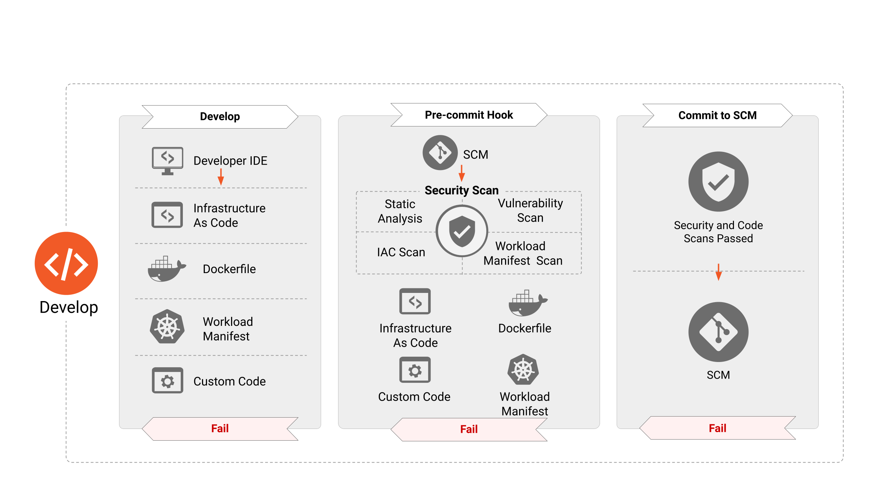
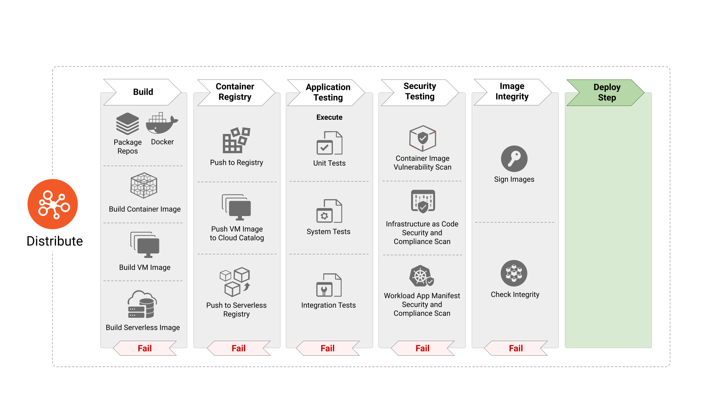
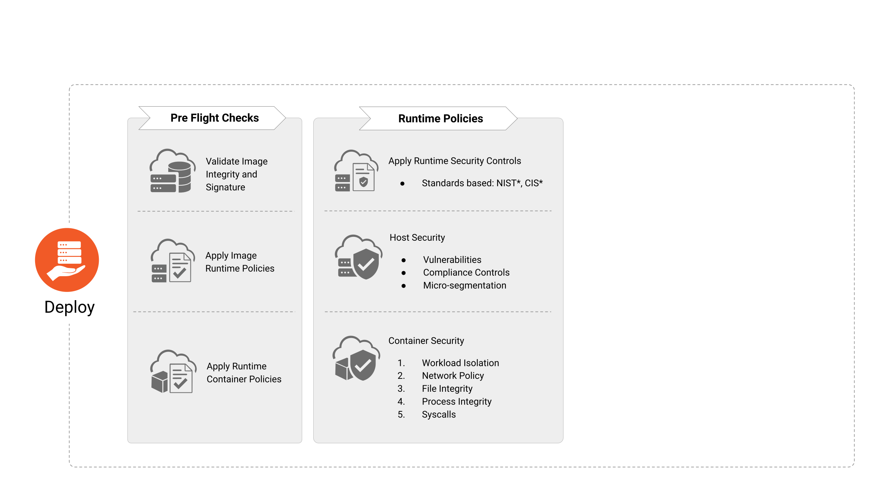
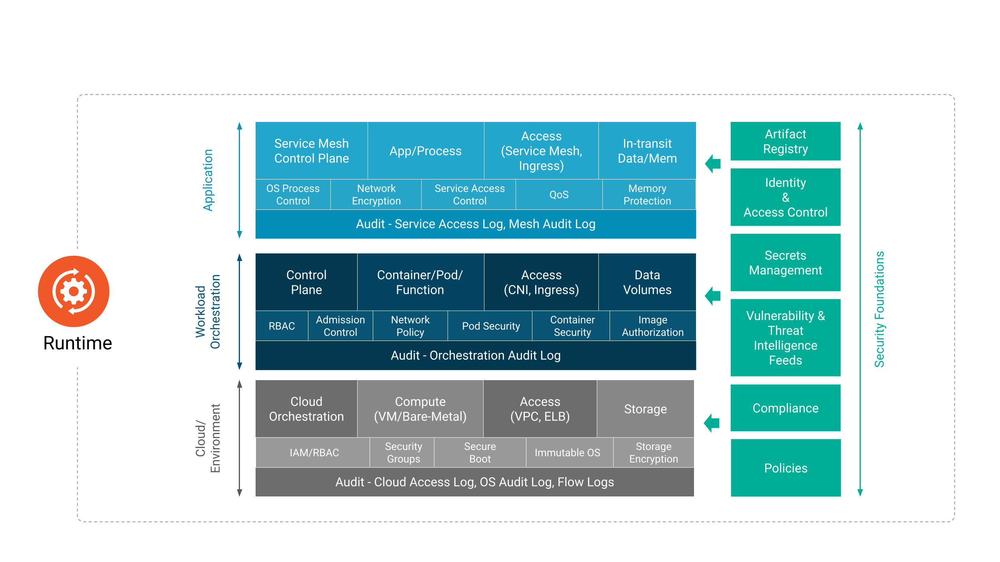

# クラウドネイティブセキュリティ入門

- [クラウドネイティブセキュリティ入門](#クラウドネイティブセキュリティ入門)
  - [1. 基本的なセキュリティの観点](#1-基本的なセキュリティの観点)
    - [1.1 セキュリティの原則](#11-セキュリティの原則)
      - [1.1.1 多層防御](#111-多層防御)
      - [1.1.2 最小権限](#112-最小権限)
      - [1.1.3 職務分掌](#113-職務分掌)
    - [1.2 セキュリティ対策の分類](#12-セキュリティ対策の分類)
      - [1.2.1 侵入防止策](#121-侵入防止策)
      - [1.2.2 検知策](#122-検知策)
      - [1.2.3 侵入後対応策](#123-侵入後対応策)
    - [1.3 ルールベース vs リスクベース アプローチ](#13-ルールベース-vs-リスクベース-アプローチ)
      - [1.3.1 ルールベースのセキュリティ対策](#131-ルールベースのセキュリティ対策)
      - [1.3.2 リスクベースのセキュリティ対策](#132-リスクベースのセキュリティ対策)
    - [1.4 セキュリティ対策の費用対効果](#14-セキュリティ対策の費用対効果)
  - [2. クラウドネイティブセキュリティ](#2-クラウドネイティブセキュリティ)
    - [2.1 従来のセキュリティモデルとの違い](#21-従来のセキュリティモデルとの違い)
    - [2.2 クラウドネイティブセキュリティの主要な原則と目標](#22-クラウドネイティブセキュリティの主要な原則と目標)
    - [2.3 クラウドネイティブの4Cモデル](#23-クラウドネイティブの4cモデル)
    - [2.4 アプリケーションの開発ライフサイクルとセキュリティの統合](#24-アプリケーションの開発ライフサイクルとセキュリティの統合)
    - [2.5 責任共有モデル](#25-責任共有モデル)
  - [3. クラウドネイティブセキュリティのベストプラクティス](#3-クラウドネイティブセキュリティのベストプラクティス)
    - [コンテナのセキュリティベストプラクティス](#コンテナのセキュリティベストプラクティス)
      - [seccomp/AppArmor の有効化](#seccompapparmor-の有効化)
      - [特権コンテナの禁止](#特権コンテナの禁止)
      - [distroless イメージの利用](#distroless-イメージの利用)
    - [Kubernetes のセキュリティベストプラクティス](#kubernetes-のセキュリティベストプラクティス)
      - [クラスタコンポーネントのセキュリティ](#クラスタコンポーネントのセキュリティ)
      - [Security Context の適用](#security-context-の適用)
      - [Secret 管理](#secret-管理)
      - [RBAC による権限管理](#rbac-による権限管理)
      - [Pod Security Admission による Pod へのポリシー強制](#pod-security-admission-による-pod-へのポリシー強制)
      - [ネットワークポリシーによる Pod 間の通信制限](#ネットワークポリシーによる-pod-間の通信制限)
      - [監視ログの利用](#監視ログの利用)
  - [セキュリティツールの活用](#セキュリティツールの活用)
    - [Trivy](#trivy)
    - [Tetragon](#tetragon)
    - [OPA (Open Policy Agent) Gatekeeper](#opa-open-policy-agent-gatekeeper)
    - [External Secrets](#external-secrets)
    - [cosign](#cosign)
    - [その他のツール](#その他のツール)
  - [まとめ](#まとめ)
  - [次のステップ](#次のステップ)

## 1. 基本的なセキュリティの観点

クラウドネイティブ固有の話に入る前に、セキュリティを考える上で必要となる観点をいくつかご紹介します。

### 1.1 セキュリティの原則

#### 1.1.1 多層防御

多層防御（Defense in Depth）は、複数レイヤーのセキュリティ対策を組み合わせることで、システム全体のセキュリティを包括的に高めるアプローチです。
クラウドネイティブ環境では、従来のアプリ・インフラレイヤーに加えて、コンテナ・クラスタレイヤーのセキュリティ対策を実施する必要があります。

#### 1.1.2 最小権限

最小権限（Least Privilege）は、認証・認可を管理する上で不可欠の原則です。
クラウドネイティブ環境における最小権限の原則は、アカウント管理に限らず、コードレベルからクラウドインフラに至るまですべてのレイヤーで適用することを求められます。

#### 1.1.3 職務分掌

職務分掌（Separation of Duties）は、担当者の持つ役割と権限、責任範囲を明確にすることを指します。
DevOpsのような境界が曖昧な環境では、開発者と運用者が担うセキュリティ対策の責任範囲について、あらかじめ定義しておくことは特に重要です。

### 1.2 セキュリティ対策の分類

#### 1.2.1 侵入防止策

システムへの不正アクセスを未然に防ぐ、または追加の侵入を阻止することを目的とします。
侵入が困難なシステムでは、攻撃者の侵入コストが高くなり、攻撃に諦めさせることにつながります。

#### 1.2.2 検知策

システム内での不正な活動や侵入後の動きを検知し、適切な対応策へとつなげます。
早期に発見することでデータの改ざんや破壊などのシステムへの影響を最小限に抑えます。

#### 1.2.3 侵入後対応策

システムに侵入された際の影響を最小限に抑え、迅速なシステムの正常化を目指します。
影響範囲や被害状況の調査、攻撃者の排除、そしてシステムの復旧などを実施します。

### 1.3 ルールベース vs リスクベース アプローチ

#### 1.3.1 ルールベースのセキュリティ対策

あらかじめ実現すべきセキュリティレベルを定義し、必要な対策をシステムに一律に適用します。

ルールベースアプローチには、明確なセキュリティ基準が確立される、全従業員・全システムへの展開が容易、リスク評価を待たずに実装できるなどのメリットがあります。 
一方で、全ルールを適用するコストが高い、ルールが陳腐化しやすい、特定のシステムに固有のリスクに対応しづらいなどのデメリットがあります。

#### 1.3.2 リスクベースのセキュリティ対策

システムを取り巻くリスクを評価し、システムの状況や求められるセキュリティ水準を踏まえて、リスクの最小化に取り組みます。

リスクベースアプローチは、組織やシステム固有のリスクに対応しやすく、本当に必要なセキュリティ対策に注力できます。 
一方で、リスク評価にはセキュリティの専門性や自組織・システムへの深い理解が必要であり、成熟度の高い組織でなければ有効活用は難しいでしょう。

### 1.4 セキュリティ対策の費用対効果

セキュリティ対策の導入検討をする際は、対策導入による「効果 - 費用」を最大化することを考えます。

費用: サービス利用料や人件費などの導入運用費の他、対策導入に伴う生産性（競争力）の低下も考慮します。 
効果: 対策導入によるリスク減少、セキュリティ品質向上に伴う競争力向上、運用効率化による生産性（競争力）向上などが評価項目となります。

## 2. クラウドネイティブセキュリティ

クラウドネイティブセキュリティは、従来のセキュリティモデルと同様に、精緻さ、整合性、信頼性、脅威防止の条件を確保しつつ、現代の「一過性（ephemerality）」「分散（distribution）」「不変性（immutability）」といった概念を統合することを目指します。

組織全体で戦略的に実行されるクラウドネイティブセキュリティは、高可用性、保証、回復力、大規模な冗長性を提供し、顧客と開発者が必要なリソースに期待する速度で安全にアクセスできるようにします。 
クラウドネイティブの目的は、迅速な開発とデプロイを通じてビジネス価値を加速させることにあります。セキュリティがこの速度を阻害するものであってはなりません。むしろ、セキュリティをアプリケーションのライフサイクルに組み込むことで、高可用性や回復力といった「価値」自体を高めることができるという視点は、セキュリティが単なるコストではなく、ビジネスの競争優位性となる可能性を示しています。

### 2.1 従来のセキュリティモデルとの違い

従来のセキュリティモデルでは、ネットワークIPアドレスのような静的な識別子に依存した境界型セキュリティが主流でしたが、クラウドネイティブ環境ではこのアプローチは非実用的です。クラウドネイティブは、開発者がコードからインフラまで全てを所有するダイナミックな環境であり、セキュリティも開発者のワークフローに適合するよう再構築される必要があります。

従来のセキュリティが「境界」を守ることに重点を置いていたのに対し、クラウドネイティブでは「静的な識別子の非実用性」が指摘されています。これは、インフラがコード化され、頻繁に変化し、コンポーネントが分散する環境では、固定的な境界線が意味をなさなくなることを意味します。 
そのため、セキュリティは開発プロセスの内部、具体的には「コード」と「ワークフロー」に深く組み込まれる必要があり、これはセキュリティアプローチの根本的な再考を要求するものです。

### 2.2 クラウドネイティブセキュリティの主要な原則と目標

クラウドネイティブセキュリティは、精緻さ、整合性、信頼性、脅威防止といった従来の目標に加え、一過性、分散、不変性といった現代の概念を統合します。目標としては、高可用性、保証、回復力、大規模な冗長性の提供が挙げられます。

クラウドネイティブの特性である「一過性」「分散」「不変性」は、システムの障害耐性を高める一方で、セキュリティの管理を複雑にする側面も持ちます。しかし、これらの特性をセキュリティに統合することで、「高可用性、保証、回復力、冗長性」といったシステムの弾力性をセキュリティ面でも実現できるとされています。これは、セキュリティが単に攻撃を防ぐだけでなく、システム全体の堅牢性を高めるための重要な要素であることを示しています。

クラウドネイティブ環境におけるセキュリティは、以下の基本原則に基づいて設計される必要があります。

- **多層防御（Defense in Depth）**: 単一のセキュリティ対策に依存するのではなく、複数のセキュリティレイヤーを組み合わせて包括的な保護を実現するアプローチです。クラウドネイティブ環境では、ネットワーク、アプリケーション、データ、アイデンティティなど、各レイヤーでセキュリティ対策を講じることで、一つの防御が突破されても他の防御によって攻撃を阻止できる可能性を高めます。
- **最小権限（Least Privilege）**: ユーザーやシステムに対して、その機能を実行するために必要最小限の権限のみを付与します。これにより、万が一アカウントやシステムが侵害された場合でも、攻撃の影響範囲を限定することができます。クラウドネイティブ環境では、サービスアカウント、Pod、コンテナそれぞれのレベルで最小権限の原則を適用することが重要です。
- **ゼロトラスト（Zero Trust）**: 従来の境界防御とは異なり、ネットワークの内部外部を問わず、すべてのアクセス試行を検証し、認証と認可を行います。クラウドネイティブ環境では、動的に生成される多数のコンポーネント間で通信が行われるため、このアプローチが特に重要になります。
- **セキュリティ・バイ・デザイン（Security by Design）**: システムの設計段階からセキュリティを組み込むアプローチです。後からセキュリティ対策を追加するのではなく、アーキテクチャの設計時からセキュリティ要件を考慮し、セキュアなシステムを構築することで、より効果的で費用対効果の高いセキュリティを実現できます。

### 2.3 クラウドネイティブの4Cモデル

https://kubernetes.io/ja/docs/concepts/security/overview/

Kubernetesセキュリティは、Cloud、Cluster、Container、Codeの4つの層から構成される4Cモデルによって体系的に整理することができます。このモデルは、各レイヤーでの責任範囲を明確にし、包括的なセキュリティ戦略の構築を支援します。

- **クラウド（Cloud）**: Kubernetesクラスタが稼働する基盤となるクラウドインフラストラクチャのセキュリティを担当します。クラウドプロバイダが提供するセキュリティ機能の活用、ネットワークセキュリティの設計、アイデンティティ・アクセス管理（IAM）の実装が含まれます。
- **クラスタ（Cluster）**: Kubernetesクラスタ自体のセキュリティを担当し、APIサーバーの保護やノード間通信の保護などを含みます。Kubernetesの認証・認可機能を活用したアクセス制御が中心となります。
- **コンテナ（Container）**: コンテナイメージのセキュリティ、コンテナランタイムの保護、そしてレジストリセキュリティを担当します。このレイヤーでは、コンテナの供給チェーンセキュリティが特に重要になります。
- **コード（Code）**: アプリケーションコード自体のセキュリティ、依存関係の管理、そしてシークレット管理を担当します。このレイヤーは、最終的にユーザーに価値を提供するアプリケーションの核心部分であり、他のすべてのレイヤーのセキュリティ対策の効果は、このレイヤーのセキュリティ品質に大きく依存します。

図が示す通り、クラスタ/コンテナ層はコードとクラウドの中間に位置します。

**アタックサーフェスの観点**では、コンテナや Kubernetes クラスタはインターネットに直接露出する必要がなく、通常は内部ネットワークに配置されるため、直接的なアタックサーフェスにはなりにくい特性があります。しかし、これは完全に安全であることを意味するものではありません。

攻撃の波及効果を考慮すると、各層の脆弱性は他の層に影響を及ぼします。

- **コード層からの影響**: アプリケーションの脆弱性（RCE、OSコマンドインジェクションなど）により攻撃者がコンテナ内部にアクセスし、そこからコンテナエスケープやクラスタ侵害へと発展する可能性があります。
- **クラウド層からの影響**: IAM 権限の過剰付与やネットワーク設定の不備により、攻撃者がクラスタの API サーバーに直接アクセスしたり、ノードを侵害したりする可能性があります。

防御の限界として、コンテナや Kubernetes のセキュリティ対策をいくら厳格に適用しても、上位層や下位層が侵害されれば、その影響を完全に遮断することは困難です。

- クラウドの管理権限が奪われた場合、クラスタ自体を削除される可能性があります。
- アプリケーションコードに機密情報がハードコーディングされている場合、コンテナレベルの保護では漏洩を防ぎきれません。

実践的なアプローチとしては、4Cの各層でのセキュリティ対策を多層防御の観点で組み合わせることが重要です。 
本講義でカバーするコンテナや Kubernetes のセキュリティ対策は、全体のセキュリティ戦略の重要な一部分であり、コードレベルでの安全な開発実践やクラウドインフラのセキュリティ強化と合わせて実施することで、真の効果を発揮します。

### 2.4 アプリケーションの開発ライフサイクルとセキュリティの統合

https://github.com/cncf/tag-security/blob/main/community/resources/security-whitepaper/v2/cloud-native-security-whitepaper.md

クラウドネイティブ開発は、「開発（Develop）」「配布（Distribute）」「デプロイ（Deploy）」「実行時（Runtime）」という明確なアプリケーションライフサイクルフェーズでモデル化できます。セキュリティは、これらのライフサイクル全体にわたって注入されるべきであり、セキュリティテストは、継続的な改善のための短く実用的なフィードバックサイクルを生成するために、コンプライアンス違反や設定ミスを早期に特定する必要があります。

従来のセキュリティがインシデント発生後の「対応」に重点を置いていたのに対し、クラウドネイティブセキュリティは「ライフサイクル全体へのセキュリティの注入」を強調しています。これは、セキュリティを開発の初期段階から組み込むことで、問題を早期に発見し、修正するコストを削減し、最終的に「予防的セキュリティ」を実現するという明確なトレンドを示しています。

- **開発 (Develop) フェーズ**
  - アプリケーションコードやIaCなどを成果物として生成します。アプリケーションへの攻撃リスクを早期に減らすため、最初のフェーズでセキュリティチェックやテストを実施します。

- **配布 (Distribute) フェーズ**
  - コンテナイメージやVMイメージなどの成果物を構築する際に、イメージのスキャンや完全性の検証など、セキュリティに特化したステップを組み込みこみます。

- **デプロイ (Deploy) フェーズ**
  - ランタイム環境にデプロイされるアプリケーションが、組織全体のセキュリティおよびコンプライアンスポリシーに適合し、準拠していることを確認するための一連のチェックを組み込みます。

- **実行 (Runtime) フェーズ**
  - コンピュート、アクセス、ストレージの3つの領域から構成され、各領域においてアプリケーションの実行環境のセキュリティ対策を講じます。

### 2.5 責任共有モデル

セキュリティは開発者だけの責任ではなく、アプリケーションチーム、プラットフォームチーム、セキュリティチーム間の「共有責任」であると認識すべきです。このモデルは、継続的な監視、自動化されたセキュリティ制御、セルフサービス、適応型セキュリティ対策を重視し、クラウドネイティブ環境の動的な性質に対応します。

セキュリティの責任が「共有」であるという概念は、単なる技術的な変更だけでなく、組織文化とチーム間のコラボレーションの変革を必要とします。開発者がセキュリティを「押し付けられる」と感じるのではなく、セキュリティが彼らのワークフローに自然に組み込まれ、価値を提供するものとして認識される必要があります。これは、セキュリティチームが「ゲートキーパー」から「イネーブラー」へと役割を変えることを意味します。

## 3. クラウドネイティブセキュリティのベストプラクティス

クラウドネイティブセキュリティには取り組むべきさまざまな観点がありますが、まずはベストプラクティスへの準拠を目指すことを推奨します。

本講義ではベストプラクティスの一部しか取り上げることはできませんが、現実のシステムにおいてはすべての項目を検討し、環境に適した対策を優先順位をつけて導入していくことになります。

### コンテナのセキュリティベストプラクティス

- **参考リンク**
  - https://docs.docker.com/build/building/best-practices/
  - https://cheatsheetseries.owasp.org/cheatsheets/Docker_Security_Cheat_Sheet.html
  - https://container-security.dev/

#### seccomp/AppArmor の有効化

seccomp (Secure Computing Mode) と AppArmor は Linux カーネルのセキュリティ機能（LSM）で、コンテナの動作を制限することで攻撃リスクを軽減します。

- seccomp: 特定のシステムコールを制限し、不要なカーネル機能へのアクセスを防ぎます。
- AppArmor: ファイルアクセスやプロセス間通信などを制御し、より詳細なセキュリティポリシーを設定できます。

#### 特権コンテナの禁止

特権 (privileged) コンテナはホストのリソースに広範なアクセス権を持ちます。
可能な限り使用を避け、必要な場合は最小限の権限で実行します。

#### distroless イメージの利用

distroless イメージは最小限のファイルのみを含む軽量なコンテナイメージです。
これをベースイメージとして利用することで、攻撃対象を最小限に抑えることができます。

Chainguard 社が提供する [Chainguard Images](https://www.chainguard.dev/chainguard-images) には、多くの OSS の distroless イメージが格納されています。

### Kubernetes のセキュリティベストプラクティス

- **参考リンク**
  - https://kubernetes.io/docs/tasks/administer-cluster/securing-a-cluster/
  - https://kubernetes.io/docs/concepts/security/pod-security-standards/
  - https://kubernetes.io/docs/concepts/security/security-checklist/
  - https://cheatsheetseries.owasp.org/cheatsheets/Kubernetes_Security_Cheat_Sheet.html
  - https://cloud.hacktricks.xyz/pentesting-cloud/kubernetes-security/kubernetes-hardening

#### クラスタコンポーネントのセキュリティ

API サーバーや kubelet などのクラスタコンポーネントへのネットワークアクセスを制限し、匿名アクセスを無効化することで、クラスタのセキュリティを向上させます。
特に API サーバーは Kubernetes クラスタの中心的な役割を果たすため、公開範囲の最小化と適切な認証認可の設定が求められます。

https://kubernetes.io/docs/reference/networking/ports-and-protocols/

#### Security Context の適用

[Security Context](https://kubernetes.io/docs/tasks/configure-pod-container/security-context/) を使用して、Pod やコンテナのセキュリティ設定を定義します。
これにより、Pod がホストシステムにアクセスする際の制限やポリシーを適用できます。

Security Context の例:

- **runAsNonRoot**
  - コンテナを非 root ユーザーとして実行することを強制します。
- **Capabilities**
  - コンテナに割り当てられる Linux ケーパビリティを制御します。必要最小限の権限でコンテナを実行し、不必要な権限を制限することができます。
- **readOnlyRootFilesystem**
  - コンテナの root ファイルシステムを読み取り専用にすることで、コンテナ内での不要なファイル作成や変更を防止します。

#### Secret 管理

Secret リソースには認証情報などの機密情報を保存しますが、デフォルトではetcd内にbase64エンコードされた状態で保存されるため（実質的に平文と同等）、追加のセキュリティ対策が必要です。

- etcdの暗号化（encryption at rest）の有効化
- Secret のマニフェストファイルの適切な管理（Git リポジトリに平文で保存しない）
- RBACによる適切なアクセス制御
- 外部シークレット管理システムの利用

本格的な運用では、[HashiCorp Vault](https://github.com/hashicorp/vault) + [External Secrets](https://github.com/external-secrets/external-secrets) のような外部のシークレット管理ツールの使用を推奨します。

#### RBAC による権限管理

[RBAC (Role-Based Access Control)](https://kubernetes.io/docs/reference/access-authn-authz/rbac/) は、ユーザーやサービスアカウントに対するアクセス権限を細かく制御します。
最小特権の原則に従い、ユーザーやアプリケーションに必要最低限の権限を付与します。

#### Pod Security Admission による Pod へのポリシー強制

[Pod Security Admission (PSA)](https://kubernetes.io/docs/concepts/security/pod-security-admission/) は、Kubernetes クラスタ内で Pod が作成または更新される際に、セキュリティポリシーを適用してクラスタ全体のセキュリティを強化するための仕組みです。 
PSA を導入することで、Pod がセキュリティベストプラクティスに従うことが保証されます。

[Pod Security Standards (PSS)](https://kubernetes.io/docs/concepts/security/pod-security-standards/) は、Pod のセキュリティ基準を定義したポリシー仕様であり、Pod Security Admission はこの基準をクラスタで強制するための Kubernetes 組み込み機能です。 PSS には、3つのセキュリティレベルが用意されています。

- **Privileged**: 制限のかかっていないポリシーで、可能な限り幅広い権限を提供します。このポリシーは既知の特権昇格を認めます。
- **Baseline**: 制限は最小限にされたポリシーですが、既知の特権昇格を防止します。デフォルト（最小の指定）のPod設定を許容します。
- **Restricted**: 厳しく制限されたポリシーで、Podを強化するための現在のベストプラクティスに沿っています。

これらのセキュリティレベルに対して、それぞれ3つのアクションの中から一つを選択します。

- **enforce**: ポリシー違反がある場合 Pod は作成されません。
- **audit**: ポリシー違反は監査ログに記録されますが、Pod 作成は許可されます。
- **warn**: ポリシー違反はユーザーに対して警告を発しますが、Pod 作成は許可されます。

#### ネットワークポリシーによる Pod 間の通信制限

ネットワークポリシーを使用して Pod 間の通信を制御し、不要な通信を遮断します。
Pod 間の通信を最小限に抑えることで、攻撃対象範囲を限定します。

たとえば、特定の Namespace 内の Pod のみが相互に通信できるように設定し、それ以外の Pod からのアクセスを拒否することで、セキュリティを強化します。
デフォルトで Deny All 方式を使用し、必要な通信だけを許可することで、より厳格なセキュリティポリシーを実現します。

Kubernetes 標準の L3-4 の [NetworkPolicy](https://kubernetes.io/docs/concepts/services-networking/network-policies/) の他、Cilium を利用している場合は L3-7 の [CiliumNetworkPolicy](https://docs.cilium.io/en/stable/network/kubernetes/policy/#ciliumnetworkpolicy) も選択肢に入ります。

なお、NetworkPolicy を利用するにはCNIプラグイン（Calico、flannel、Weave Netなど）が NetworkPolicy をサポートしている必要があります。

#### 監視ログの利用

Kubernetes の監査ログは、クラスタ内での全ての API リクエストを記録し、セキュリティやコンプライアンスの要件を満たすための重要な機能です。
これにより、誰がいつ何を行ったのかを追跡でき、不正アクセスや異常な活動を検知するのに役立ちます。 
監査ポリシーをカスタマイズすることで、必要な情報だけをログに記録し、ログの管理や解析を効率化できます。

https://kubernetes.io/docs/tasks/debug/debug-cluster/audit/

## セキュリティツールの活用

Kubernetesのセキュリティを強化するためには、さまざまなツールの活用が効果的です。 
以下に代表的なセキュリティツールをいくつかご紹介します。

ここで紹介するツール以外にも、「[Cloud Native Landscape](https://landscape.cncf.io/guide#provisioning--security-compliance)」にあるように多数のセキュリティツールが存在するので、色々なツールを探索してみると面白いです。

### Trivy

https://github.com/aquasecurity/trivy

オープンソースのセキュリティスキャナーで、コンテナイメージ、ファイルシステム、Kubernetes クラスタ、リポジトリ内の脆弱性や設定ミスを検出します。 
CLI ツールとして簡単に実行でき、脆弱性管理とコンプライアンス維持に役立ちます。 
CI/CD パイプラインへの統合も容易で、クラウドネイティブな環境でのセキュリティ対策を強化するために広く利用されています。

**類似ツール**:
- [Clair](https://github.com/quay/clair)
- [grype](https://github.com/anchore/grype)
- [kube-bench](https://github.com/aquasecurity/kube-bench)
- [Kubescape](https://github.com/kubescape/kubescape)

### Tetragon

https://github.com/cilium/tetragon

eBPF を活用したセキュリティおよび監視ツールで、Kubernetes クラスタ内の実行中のプロセスやシステムコールをリアルタイムで監視します。 
Tetragon を使用することで、セキュリティイベントの検出や通信制限、ファイルアクセス制限などを実現できます。

**類似ツール**:
- [Falco](https://github.com/falcosecurity/falco)
- [Tracee](https://github.com/aquasecurity/tracee)

### OPA (Open Policy Agent) Gatekeeper

https://github.com/open-policy-agent/gatekeeper

Kubernetes 環境におけるポリシー管理とリソース制御を行うためのオープンソースツールです。
Open Policy Agent (OPA) と統合されており、Kubernetes リソースに対する動的なポリシー適用を可能にします。
クラスタ内でのリソース作成や更新時に、事前に定義されたポリシーに基づく検証が行われ、コンプライアンスやセキュリティを強化できます。 
監査機能も提供しており、ポリシー違反を検出してレポートすることが可能です。

**類似ツール**:
- [Kyverno](https://github.com/kyverno/kyverno)
- [Pod Security Admission](https://kubernetes.io/docs/concepts/security/pod-security-admission/)
- [Validating Admission Policy](https://kubernetes.io/docs/reference/access-authn-authz/validating-admission-policy/)

### External Secrets

https://github.com/external-secrets/external-secrets

外部のシークレット管理システムから、Kubernetes クラスタ内にシークレットを安全に取得・同期するための Kubernetes オペレーターです。
AWS Secrets Manager、HashiCorp Vault などの外部シークレットストアと統合されており、これらのシークレットを Kubernetes Secret として自動的に同期します。

**類似ツール**:
- [Secrets Store CSI Driver](https://github.com/kubernetes-sigs/secrets-store-csi-driver)
- [Sealed Secrets](https://github.com/bitnami-labs/sealed-secrets)

### cosign

https://github.com/sigstore/cosign

Sigstoreプロジェクトの一部である、コンテナイメージの署名と検証を行うためのオープンソースツールです。Kubernetes 環境において、イメージの信頼性と整合性を保証するために使用されます。 
cosign は、シンプルな CLI ツールとして提供されており、keyless signing（鍵なし署名）やOIDCベースの署名、イメージの検証、SBOM や Attestation（証明）の添付などをサポートしています。

### その他のツール

- **[Image pull secrets provisioner](https://github.com/pfnet/image-pull-secrets-provisioner)**
  - Kubernetesクラスタ内で ImagePullSecrets を自動的にプロビジョニングするツール。
- **[KubeArmor](https://github.com/kubearmor/KubeArmor)**
  - Kubernetes クラスタ内のコンテナやノードに対してセキュリティポリシーを適用するためのツール。
- **[1Password Connect Kubernetes Operator](https://github.com/1Password/onepassword-operator)**
  - 1Password からシークレットを Kubernetes クラスタに安全に供給するためのオペレーター。
- **[KBOM](https://github.com/rad-security/kbom)**
  - Kubernetes クラスタ内のソフトウェア部品表 (SBOM) を生成するためのツール。
- **[kubelogin](https://github.com/int128/kubelogin)**
  - OIDC プロバイダーを使用して Kubernetes にログインするための CLI ツール。
- **[OpenSSF Scorecard](https://github.com/ossf/scorecard)**
  - OSS のセキュリティレベルをチェックし、利用者が OSS の安全性を評価できるようにするためのツール。

## まとめ

- Kubernetes のセキュリティはクラスタ、コンテナなどの複数の要素かつ、開発ライフサイクルの各段階で多層的にアプローチすることが重要です。
- ベストプラクティスに準拠して Kubernetes 環境を構築し、その上でさまざまなセキュリティツールを活用してセキュリティ運用を効率化します。
- セキュリティは一度設定して終わりではありません。継続的に運用・改善し続ける活動を通して、安全な Kubernetes 運用を実現しましょう。

---

## 次のステップ

- [演習2 コンテナシステムへの攻撃と対策の実践](./training2.md)
